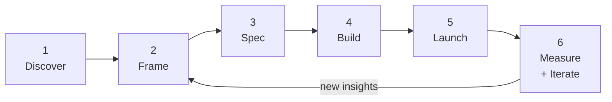

# The AI PM Playbook

A single reference for the full AI product lifecycle. Open this when starting any AI feature — from first idea to post-launch iteration.

Each stage maps to the course modules where the concepts are covered in depth.

---

## The AI product lifecycle



---

## Stage 1: Discover
*Is this the right problem for AI?*

**Reference modules:** [1 — AI Product Landscape](module-01-ai-product-landscape.md) · [16 — AI Product Management](module-16-ai-product-management.md)

### Key questions
- Is there a language or reasoning task at the core of this problem?
- Would a skilled human doing this manually be valuable?
- Is the error tolerance acceptable — can this be occasionally wrong?
- Does AI beat the non-AI alternative meaningfully?
- Which category does this fall into: vertical AI, augmented incumbent, AI-native?

### Spike checklist
Before any roadmap commitment, run a 1–3 day spike:
- [ ] Can the model do this task on our actual data (not a vendor demo)?
- [ ] What is the realistic quality bar achievable with prompting alone?
- [ ] What are the top 3 failure modes?
- [ ] What's the rough architecture: single call, RAG, or agentic?
- [ ] Does the cost per request work at expected volume?

**Gate:** Only move to Frame if the spike shows the quality bar is achievable and the cost works.

---

## Stage 2: Frame
*What exactly are we building and for whom?*

**Reference modules:** [16 — AI Product Management](module-16-ai-product-management.md)

### Complete the AI problem statement
```
When [user context],
they need to [task],
but currently [friction/gap].
An AI feature could [specific capability],
so that [measurable user outcome].
```

### Identify the job to be done
- [ ] **Reduce effort** — doing something manual, faster
- [ ] **Extend capability** — doing something not previously possible
- [ ] **Improve decisions** — surfacing information the user would otherwise miss

### Prioritisation: AI-RICE
```
Score = (Reach × Impact × Confidence × Feasibility) ÷ Effort
```
Feasibility comes from the spike (0 = failed, 1 = works well).

**Gate:** Problem statement complete and agreed with stakeholders before speccing begins.

---

## Stage 3: Spec
*What does the AI need to do, and how will we know it's good enough?*

**Reference modules:** [7 — Prompt Engineering](module-07-prompt-engineering.md) · [5 — RAG](module-05-rag.md) · [6 — Agents](module-06-agents-tool-use.md) · [9 — Safety](module-09-ai-safety-responsible-ai.md) · [13 — Working with Engineers](module-13-working-with-ai-engineers.md)

### AI feature brief (complete all sections)

**Behaviour spec**
- [ ] Role definition (who is the AI, what domain?)
- [ ] Task description (specific, not "help users with X")
- [ ] Input format and edge cases
- [ ] Output format — prose, JSON, structured text? Include example of a good output
- [ ] Example of a bad output (often more useful)
- [ ] Constraints: what must it never do?
- [ ] Failure instruction: what does it say when it doesn't know?
- [ ] 2–3 few-shot examples for complex behaviours

**Architecture decisions**
- [ ] Single call, RAG, or agentic? (→ Module 4)
- [ ] If RAG: what data sources, who owns freshness, access control requirements? (→ Module 5)
- [ ] If agentic: what tools, max model calls per request, human-in-the-loop gates? (→ Module 6)
- [ ] Model tier and justification (→ Module 11)
- [ ] Is prompt caching applicable? (→ Module 11)

**Quality bar**
- [ ] What metric defines "good enough to ship"? (acceptance rate / accuracy / task completion)
- [ ] What is the minimum passing score?
- [ ] How will it be measured? (human review, LLM-as-judge, A/B test)

**Eval dataset**
- [ ] 30+ representative inputs with expected outputs
- [ ] 10+ edge cases
- [ ] 5+ adversarial inputs (jailbreak attempts, out-of-scope requests)

**Safety and compliance**
- [ ] Harm taxonomy completed (→ Module 9)
- [ ] Red-team exercise scoped
- [ ] Applicable regulations identified (EU AI Act, GDPR, HIPAA)
- [ ] Access control requirements at retrieval layer

**Constraints**
- [ ] Latency budget
- [ ] Cost per request at expected volume
- [ ] Data sources and permissions

**Gate:** Spec reviewed with engineering. Eval dataset exists. Quality bar is a number, not a feeling.

---

## Stage 4: Build
*Iterate to the quality bar, then integrate.*

**Reference modules:** [13 — Working with Engineers](module-13-working-with-ai-engineers.md) · [10 — Build vs. Buy](module-10-build-vs-buy.md)

### Sprint planning checks
- [ ] Spike findings shared with the team before estimation
- [ ] Estimate includes prompt iteration cycles, not just integration
- [ ] Build vs. buy decided for each infrastructure layer (→ Module 10)
- [ ] System prompt is in version control with a review process
- [ ] Eval dataset is in version control alongside the prompt

### Weekly iteration review
Each week during build, check:
- [ ] Current eval score vs. quality bar — are we converging?
- [ ] Top 3 current failure modes — are they the same as last week or new ones?
- [ ] Are new failure cases being added to the eval dataset?
- [ ] Is the team stuck on one failure pattern? (If yes, consider changing approach)

### Pre-integration checklist
Before connecting to UI and data sources:
- [ ] Eval score meets the launch quality bar
- [ ] Red-team exercise completed and critical findings resolved
- [ ] Output format is stable and parseable
- [ ] Error handling defined for all failure modes

**Gate:** Eval score at or above launch bar. Red-team complete. No unresolved critical safety findings.

---

## Stage 5: Launch
*Ship the right thing with the right safeguards.*

**Reference modules:** [8 — AI UX Patterns](module-08-ai-ux-patterns.md) · [9 — Safety](module-09-ai-safety-responsible-ai.md) · [14 — Evaluation](module-14-evaluation.md)

### UX checklist
- [ ] AI scope communicated to users specifically (not "Powered by AI")
- [ ] AI output visually distinguished from verified data
- [ ] Users can edit or regenerate output
- [ ] Streaming or staged progress indicator (not blank spinner)
- [ ] Sources/citations shown for factual features
- [ ] All three graceful degradation tiers designed (partial answer / I don't know / escalate)
- [ ] Thumbs up/down with logging
- [ ] Out-of-scope redirect designed

### Monitoring setup (must be live at launch)
- [ ] Interaction events logging: accept, edit, regenerate, dismiss, rating
- [ ] Error rate and failure mode tracking
- [ ] Latency monitoring
- [ ] Safety filter trigger rate
- [ ] Dashboards ready: daily ops + weekly PM review

### Incident playbook (ready before launch)
- [ ] Rollback plan: previous prompt version ready to deploy
- [ ] Escalation path defined: who is notified if a harmful output is reported?
- [ ] User-facing reporting mechanism in place
- [ ] Criteria for disabling the feature defined

### Staged rollout
- [ ] 10% traffic first with quality monitoring
- [ ] Clear criteria for full rollout vs. rollback
- [ ] Full rollout only after quality confirmed at scale

**Gate:** Monitoring live. Incident playbook ready. Staged rollout criteria defined.

---

## Stage 6: Measure & Iterate
*Close the loop and make it better.*

**Reference modules:** [12 — Data Strategy](module-12-data-strategy.md) · [15 — Measuring AI Product Success](module-15-measuring-ai-product-success.md)

### Weekly PM review metrics
| Metric | What a change signals |
|--------|----------------------|
| Acceptance rate | Quality shift (prompt change? model drift?) |
| Regeneration rate | Users not getting what they need |
| Edit distance | How far output is from what users actually want |
| Thumbs down rate | Direct quality dissatisfaction |
| Error / failure rate | Infrastructure or prompt problems |

### Monthly health review
- [ ] AI vs. non-AI user outcome comparison (retention, task completion, conversion)
- [ ] Hallucination sample review (100–200 outputs reviewed for factual accuracy)
- [ ] Cost per request vs. business value generated
- [ ] Eval dataset run against current prompt — any regressions?
- [ ] Production failure cases added to eval dataset

### Iteration triggers
Act when:
- Acceptance rate drops >5% without a known change → investigate prompt or model drift
- Regeneration rate spikes → sample the contexts, find the pattern
- A production failure type is new → add to eval dataset, fix prompt, re-run evals

### Data flywheel check (quarterly)
- [ ] Are interaction signals (accept/edit/reject) being used to improve prompts?
- [ ] Is the labeled dataset growing from production failures?
- [ ] Is the RAG index fresh and accurate?
- [ ] Is proprietary data accumulating in a way that creates differentiation?

**Gate:** Monthly review completed. Production failures added to eval dataset. Data flywheel is turning.

---

## Master checklist: AI feature launch readiness

Use this as a final gate before any AI feature ships to production.

### Problem and spec
- [ ] AI problem statement complete with measurable user outcome
- [ ] AI feature brief covers behaviour, quality bar, failure handling, constraints
- [ ] Good and bad output examples in spec
- [ ] Eval dataset: 30+ representative + 10+ edge cases + 5+ adversarial

### Architecture
- [ ] Architecture pattern decided: single call / RAG / agentic
- [ ] Model tier justified
- [ ] Cost per request estimated at expected volume
- [ ] If RAG: access control enforced at retrieval layer
- [ ] If agentic: tool access is least-privilege; human-in-the-loop for irreversible actions

### Quality
- [ ] Eval score meets defined launch bar
- [ ] Red-team exercise completed; critical findings resolved
- [ ] System prompt in version control with review process
- [ ] Process defined for running evals before any future prompt or model change

### UX
- [ ] AI scope communicated specifically to users
- [ ] Edit/regenerate available
- [ ] Graceful degradation tiers designed for all failure modes
- [ ] Feedback mechanism (thumbs up/down) with logging

### Safety and compliance
- [ ] Harm taxonomy completed
- [ ] Applicable regulations reviewed with legal
- [ ] User-facing mechanism to report harmful outputs
- [ ] Prompt injection addressed for agentic features

### Operations
- [ ] Interaction logging live from day one
- [ ] Daily ops dashboard ready
- [ ] Incident playbook ready (rollback, escalation, disable criteria)
- [ ] Staged rollout plan with rollback criteria

---

## Module reference map

| When you need to... | Go to |
|--------------------|-------|
| Understand the AI product market | [Module 1](module-01-ai-product-landscape.md) |
| Explain how models work to a stakeholder | [Module 2](module-02-how-llms-work.md) |
| Scope a vision, audio, or image feature | [Module 3](module-03-multimodal-ai.md) |
| Map an AI feature to its architecture | [Module 4](module-04-ai-product-stack.md) |
| Spec a knowledge base or Q&A feature | [Module 5](module-05-rag.md) |
| Design an agentic workflow | [Module 6](module-06-agents-tool-use.md) |
| Write or review a system prompt | [Module 7](module-07-prompt-engineering.md) |
| Design the user-facing AI experience | [Module 8](module-08-ai-ux-patterns.md) |
| Identify risks and run a red-team | [Module 9](module-09-ai-safety-responsible-ai.md) |
| Decide whether to build or use a vendor | [Module 10](module-10-build-vs-buy.md) |
| Estimate cost and choose a model tier | [Module 11](module-11-cost-latency.md) |
| Plan your data strategy and moat | [Module 12](module-12-data-strategy.md) |
| Work with engineers on AI features | [Module 13](module-13-working-with-ai-engineers.md) |
| Write acceptance criteria and run evals | [Module 14](module-14-evaluation.md) |
| Define and track AI product metrics | [Module 15](module-15-measuring-ai-product-success.md) |
| Manage the full AI PM lifecycle | [Module 16](module-16-ai-product-management.md) |
| Look up a decision quickly | [Quick Reference](quick-reference.md) |
