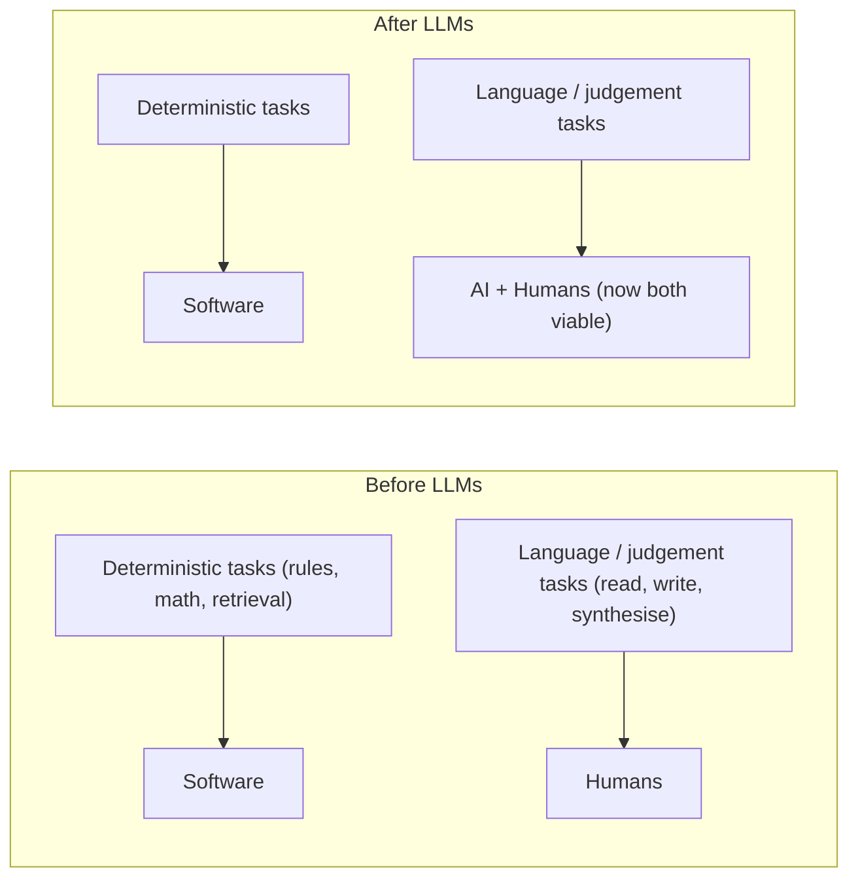
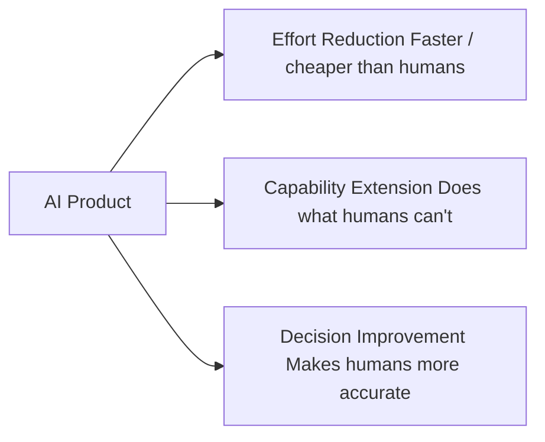
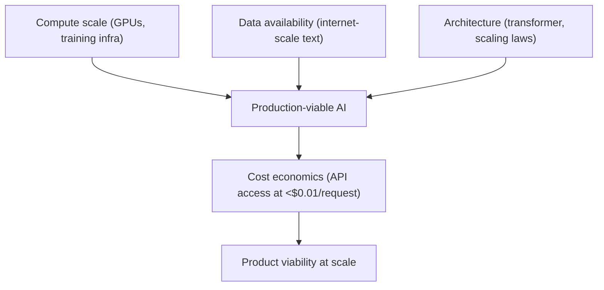
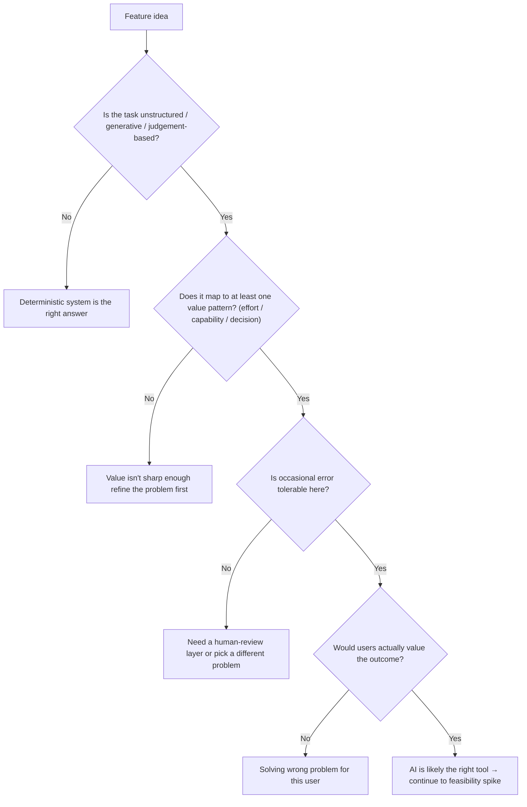

# Module 1: Why AI Products Exist

## The question this module answers

Before you learn what kinds of AI products exist (Module 2) or how they work (Module 3), it's worth pausing on a more fundamental question: why does this whole category exist at all? What changed in the world that made AI products viable, what kind of value do they uniquely create, and how do you tell when AI is genuinely the right answer versus a fashionable wrapper around a problem that didn't need it?

Answering this matters because most bad AI products fail at this layer — not at the technology, the prompt, or the UX, but at the prior question of whether AI was the right tool for the job in the first place.

---

## The capability shift

For most of computing history, software has been deterministic. You write rules; the computer follows them. This works brilliantly for tasks that can be specified precisely: arithmetic, transactions, data retrieval, state management.

But a huge category of valuable work — most knowledge work — doesn't fit that mould. Reading a contract and identifying the risks. Listening to a customer call and summarising what matters. Drafting a thoughtful response to an email. Synthesising findings from twenty research papers. These tasks share three properties that traditional software couldn't handle:

1. The input is **unstructured** (natural language, images, audio)
2. The "right answer" is **judgement-based**, not rule-based
3. The output requires **generation**, not just retrieval

Until recently, the only way to do these tasks at scale was to hire humans. That's why knowledge work is expensive — there was no alternative.

Large language models changed this. For the first time, software can do tasks in this category at quality levels that approach (and sometimes exceed) the average human — at a fraction of the cost and at machine speed.

That shift — from "humans only" to "humans + AI" for an enormous class of tasks — is the foundation everything else in this course is built on.

---

## What AI products are uniquely good at

Three characteristics define tasks where AI products genuinely outperform alternatives:

### 1. The input is unstructured
PDFs, free-text fields, transcripts, photos, voice recordings. Anything where the meaningful content isn't in well-defined database columns. Traditional software requires structure first; AI can extract structure from chaos.

**Examples:** Extracting fields from invoices of varying formats, reading clinical notes, parsing customer emails.

---

### 2. The output requires generation, not just lookup
Drafting, summarising, translating, synthesising. The AI produces something that didn't exist before — not a record fetched from a database, but a new artefact composed for the specific context.

**Examples:** Writing a personalised cover letter, summarising a 50-page report into 3 paragraphs, generating a draft response based on full conversation context.

---

### 3. The task benefits from "soft" judgement
There isn't a single correct answer; there's a spectrum of better and worse responses, and the appropriate response depends on context, tone, audience, or nuance.

**Examples:** Suggesting how to handle a customer complaint, recommending priorities for a triage queue, giving feedback on a draft.

When all three are present, AI is likely the right tool. When none are present, AI is probably the wrong tool — a deterministic system will be cheaper, faster, and more reliable.

---

## The three value patterns

Every successful AI product creates value in one (or more) of three patterns. Knowing which pattern applies to your feature shapes how you measure success and what you're really competing on.

### Pattern 1: Effort reduction
AI does something a human currently does manually — faster, cheaper, or both. The output may not exceed what a human could produce, but it gets done at a fraction of the cost.

**Test:** Would a human doing this produce roughly equivalent output, just slower?

**Examples:** Meeting transcription, code autocomplete, draft email replies, automated ticket triage.

**Success metric:** Time saved, throughput increase, cost per unit of work.

---

### Pattern 2: Capability extension
AI does something the user couldn't reasonably do at all — not because of skill, but because of scale, speed, or cognitive load.

**Test:** Is this something the user genuinely could not do without AI, regardless of effort?

**Examples:** Searching across 10,000 documents semantically, real-time translation in conversation, finding patterns across years of customer interactions, generating images from descriptions.

**Success metric:** Tasks now possible that weren't before, novel capabilities used per user.

---

### Pattern 3: Decision improvement
AI surfaces information, recommendations, or analysis that helps the user make better decisions than they would alone.

**Test:** Does this change what the user does next, in a way that produces better outcomes?

**Examples:** Risk flags on contracts, anomaly detection in financial data, code review suggestions, customer churn predictions.

**Success metric:** Decision quality lift, error reduction, outcome improvement.

---

A feature can serve more than one pattern, but it should serve at least one clearly. If you can't articulate which pattern your feature creates value through, that's a sign the value proposition isn't sharp enough.

---

## Why this is happening now

LLM-class capability didn't appear overnight. It became viable for product use because of a convergence of three forces, all of which only fully arrived in the last few years:

**Compute:** Training a frontier model requires hundreds of millions of dollars of GPU time. That kind of compute didn't exist at affordable scale until recently.

**Data:** Models learn from massive text corpora. The internet at its current size made it possible to assemble training datasets large enough for modern model capability.

**Architecture:** The transformer architecture (introduced 2017) plus the empirical observation that performance scales predictably with model and data size made systematic capability improvement possible.

**Economics:** API pricing at fractions of a cent per request means AI features can be embedded in products without breaking unit economics. This wasn't true even three years ago.

The PM implication: this is a moment when an enormous category of previously-unsolvable problems just became solvable. The opportunity isn't going away, but the competitive landscape will be defined in this period. Your decisions now matter more than they will in five years.

---

## When AI is the right tool

Combining the capability shift, the three "what AI is good at" criteria, and the three value patterns gives a practical test for any product idea:

**An AI feature is the right answer when:**
- The task involves unstructured input or generation, AND
- It maps to at least one of the three value patterns clearly, AND
- A user (or the business) actually values the outcome enough, AND
- Occasional errors are tolerable (with appropriate review/fallback)

**An AI feature is the wrong answer when:**
- The task is fully deterministic (use a database query, formula, or rule)
- The task requires 100% accuracy with no room for review (high-stakes legal, financial, medical actions without oversight)
- A simpler product change would solve the user's problem (a search filter, a template, a dropdown)
- You're adding AI for marketing reasons rather than user value

The most expensive AI mistakes happen when this prior question is skipped. A team builds a sophisticated AI feature for a task that should have been a button or a database query — adding cost, complexity, hallucination risk, and ongoing maintenance burden in exchange for marginal user value.

### Good-enough threshold by use case

When evaluating "is occasional error tolerable?" in the AI opportunity filter, you need a reference point — not just an abstract yes/no. The table below gives approximate acceptable error rates by use case category, based on typical user tolerance and consequence of error.

| Use Case Category | Acceptable Error Rate | Why |
|---|---|---|
| Code autocomplete | ~60% | User reviews every suggestion before accepting; wrong ones are dismissed instantly with no downstream consequence |
| Email drafting | ~75% | User reads and edits before sending; saves time even when the draft needs significant revision |
| Support ticket triage | ~85% | Misrouted tickets waste agent time but are recoverable; some error rate is accepted to gain throughput |
| Content moderation | ~90% | Human review layer catches escalations; the AI handles volume, humans handle edge cases |
| Medical documentation | ~95% | Clinician reviews before sign-off, but errors erode trust rapidly and carry liability risk |
| Financial trading signals | ~99%+ | Signals may trigger automated execution with real money; errors are immediate and often unrecoverable |

These thresholds exist on a spectrum driven by two factors: (1) whether a human reviews before consequential action is taken, and (2) how costly or reversible an error is. As you move down the table, both factors tighten.

**PM decision:** Before committing to an AI approach, identify your threshold. If the current technology can't reach it, AI isn't ready for your use case — wait, add a human review layer, or choose a different approach.

---

## The "AI rightness" test

Before any AI feature gets serious investment, run it through this sequence:

A "yes" all the way through doesn't guarantee success — feasibility, cost, quality bar, and competition still matter — but a "no" at any point is a strong signal to stop or rethink.

---

## What this means for the rest of the course

The remainder of this course works through the implications of this foundational shift:

- **What kinds of AI products exist** (Module 2 — landscape)
- **How the underlying technology works** (Modules 3–4)
- **How PMs operate in this new space** (Module 5)
- **How AI products are architected** (Modules 6–8)
- **The PM craft skills you'll apply** (Modules 9–11)
- **The strategic decisions you'll make** (Modules 12–14)
- **How AI features get shipped, monitored, and run in production** (Modules 16–20)

Every module assumes the foundation laid here: AI products exist because something fundamental changed in what software can do, they create value in identifiable patterns, and the PM's first job is to know when AI is genuinely the right answer.

---

## PM Decision Checklist — Module 1

Before any AI feature gets serious investment:

- [ ] Is the core task unstructured, generative, or judgement-based — not deterministic?
- [ ] Which of the three value patterns does this serve: effort reduction, capability extension, or decision improvement?
- [ ] Can I articulate the value pattern in one sentence?
- [ ] Is occasional error tolerable, or do I need a human-review layer?
- [ ] Would a simpler non-AI solution (a filter, a template, a database query) solve the problem adequately?
- [ ] Am I adding AI because users will value it, or because the company wants to ship "AI features"?
- [ ] Does the feature pass the AI rightness test all the way through?
