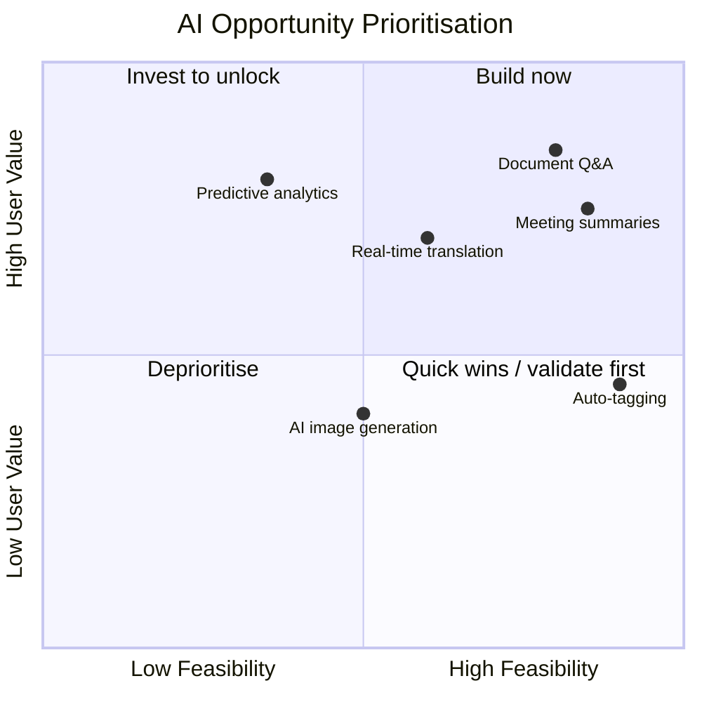
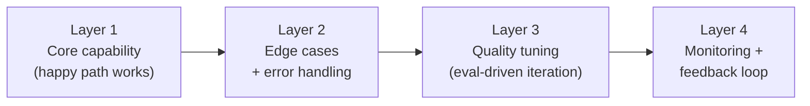

# Module 4: AI Product Management

## What's different about being a PM for AI

Traditional PM skills — discovery, prioritisation, spec writing, stakeholder communication — all still apply. But AI products introduce a set of challenges that don't exist in conventional software:

- **Capability uncertainty:** You can't always know if AI can do something well enough until you've tested it. Discovery and prototyping are inseparable.
- **Quality is a dial, not a switch:** AI features don't "work" or "not work" — they exist on a quality spectrum. Deciding what quality bar is good enough for launch is a PM judgement call.
- **The product changes after launch:** Model updates, prompt changes, and data drift mean your AI feature's behaviour can change without a code deploy. Monitoring is part of the product.
- **Users have no mental model:** Most users don't know what AI can and can't do. Setting expectations is a product design responsibility, not a marketing one.
- **Failure modes are novel:** An AI feature doesn't crash — it gives a confident wrong answer. Your escalation paths, fallbacks, and monitoring need to account for this.

---

## Stage 1: Opportunity identification

Not every problem should be solved with AI. The first PM skill is identifying where AI adds genuine value versus where it adds complexity without benefit.

### The AI opportunity filter

Run every potential AI feature through these four questions before it goes on the roadmap:

**1. Is there a language or reasoning task at the core?**
AI excels at understanding, generating, and reasoning about language and unstructured content. If the core task is displaying or processing structured data, a database query is better.

**2. Would a human doing this task manually be valuable?**
If you'd pay a skilled person to do this task — analyse this document, summarise this call, draft this response — AI can probably do it at scale. If you wouldn't, question whether AI adds value.

**3. Is the output tolerance for error acceptable?**
AI will occasionally be wrong. Is being occasionally wrong acceptable for this use case, or does it require 100% accuracy? (If the latter, AI is the wrong tool without a robust human review layer.)

**4. Does it beat the alternative?**
Compare the AI solution to the non-AI alternative honestly. If the non-AI solution (a search box, a dropdown, a template) solves the problem adequately, AI adds cost and complexity for marginal gain.

---

### The AI value matrix

Map opportunities by value and feasibility:



**Feasibility** = can the model do this task at acceptable quality on your data, with your constraints?
**Value** = how much does this improve the user's outcome or reduce their effort?

Run a spike (1–3 days of engineering exploration) to validate feasibility before committing to the roadmap.

---

## Stage 2: Problem framing

How you frame an AI problem determines what gets built. Vague framing produces features that technically work but don't solve the user's actual problem.

### The AI problem statement

A complete AI problem statement has five parts:

```
When [user is in this context],
they need to [accomplish this task],
but currently [this friction/gap exists].
An AI feature could [specific capability],
so that [measurable outcome for the user].
```

**Example — weak framing:**
"Users want AI to help with their documents."

**Example — strong framing:**
"When a support agent opens a new ticket with a long email thread attached, they need to understand the customer's core issue within 30 seconds, but currently they read the full thread manually which takes 3–5 minutes per ticket. An AI feature could summarise the thread into three sentences (issue, context, priority), so that agents handle 40% more tickets per shift without sacrificing resolution quality."

The strong version defines the context, the specific task, the current friction, the AI capability, and the measurable outcome. Every word matters for scoping what gets built and evaluated.

---

### Jobs-to-be-done for AI features

AI features serve one of three fundamental jobs:

| Job | What users want | Examples |
|-----|----------------|---------|
| **Reduce effort** | Do something I currently do manually, faster | Summarise, draft, classify, extract |
| **Extend capability** | Do something I can't do at all without AI | Analyse 10,000 records, find patterns across documents |
| **Improve decisions** | Give me information I'd otherwise miss | Recommend, surface risks, predict outcomes |

Knowing which job your feature serves determines how you measure success. Effort reduction = time saved. Capability extension = tasks now possible. Decision improvement = outcome quality.

---

## Stage 3: Roadmapping AI features

AI features have different planning characteristics than standard features.

### The spike-first principle

Never put an AI feature directly into a sprint without a preceding spike. A spike answers:
- Can the model do this task at acceptable quality on our actual data?
- What's the rough prompt architecture needed?
- What are the main failure modes?
- What's the realistic quality bar, and is it good enough to ship?

**Spike output:** A short written finding (not just a demo) covering quality bar, main failure modes, and recommended approach. This is the input to the feature estimate.

Without a spike, your estimate is fiction. A 2-week feature that fails the spike becomes a 6-week feature or gets cancelled mid-sprint.

---

### Layered delivery: MVP to production quality

AI features rarely ship at full quality on day one. Plan delivery in layers:



**Layer 1** ships when the feature works for the majority of cases. Users get value. You learn from production data.
**Layers 2–3** improve coverage and quality based on what production data reveals.
**Layer 4** closes the loop — production signals feed back into prompt improvement and eval datasets.

Define the launch bar at Layer 1. Don't wait for Layer 3 quality before getting user feedback.

---

### Communicating AI timelines to stakeholders

Stakeholders used to traditional software expect deterministic timelines. AI development has genuine uncertainty that needs to be managed upfront.

**Frame it as:**
```
"We're running a spike by [date] to validate whether the approach works 
and at what quality. Based on spike findings, we'll give an iteration 
estimate. We're targeting [date range] for launch at an initial quality 
bar of [specific metric], with planned improvements in the following 
sprint based on production data."
```

**Never commit to:**
- A specific launch date before a spike is complete
- "It'll be production-quality" without a defined quality metric
- A fixed scope for an AI feature that hasn't been prototyped

---

## Stage 4: Writing AI requirements

AI requirements need to capture things that don't exist in traditional specs. Module 13 covers this in detail from the engineering collaboration perspective — this section covers the PM authoring side.

### The AI feature brief

Every AI feature should have a brief that answers:

**Problem**
- What is the user's job to be done?
- What's the current friction?
- What does success look like for the user?

**Behaviour**
- What is the AI's role? (Role definition from Module 7)
- What inputs does it receive?
- What does a good output look like? Include an example.
- What does a bad output look like? Include an example.
- What must it never do?
- What should it do when it doesn't know?

**Quality bar**
- What metric defines "good enough to ship"?
- What's the evaluation method?
- What does the eval dataset cover?

**Failure handling**
- What happens when the model fails or returns low-confidence output?
- Is there a human review layer? When does it trigger?
- What does the user see when AI can't complete the task?

**Constraints**
- Model tier
- Latency budget
- Cost per request at expected volume
- Data sources and access control requirements
- Safety and compliance requirements

---

## Stage 5: Prioritisation frameworks for AI

Standard prioritisation frameworks need adapting for AI.

### RICE adjusted for AI

Standard RICE: Reach × Impact × Confidence ÷ Effort

For AI features, add a **Feasibility** score (0–1) based on spike results:

```
AI-RICE = (Reach × Impact × Confidence × Feasibility) ÷ Effort
```

A high-impact feature with low feasibility (0.3) scores appropriately lower than a medium-impact feature with high feasibility (0.9).

---

### The AI-specific deprioritisation triggers

An AI feature should be deprioritised or descoped when:

- **Spike failed:** The model can't do the task at acceptable quality on our data
- **Cost doesn't justify value:** Cost per request × volume exceeds willingness to pay
- **Deterministic alternative exists:** A rules-based or database solution solves it reliably
- **Safety risk is unresolved:** Red-team found unresolved harms with no mitigation path
- **Dependency isn't ready:** Data source, retrieval system, or access controls aren't in place

---

## Stage 6: Stakeholder and user communication

### Communicating AI capabilities to users

Users need to know three things:
1. **What it can do** — specific, not general ("Summarise your ticket history" not "Powered by AI")
2. **What it can't do** — explicit scope boundaries reduce failed expectations
3. **That it might be wrong** — calibrate trust without undermining confidence

Write UI copy and onboarding for AI features the same way you'd write safety instructions for a power tool: clear, specific, and honest about limitations.

---

### Communicating AI results to leadership

When reporting on AI feature performance to leadership, avoid:
- "The model performs well" (what does that mean?)
- "Users love it" (what's the metric?)
- "We'll improve quality over time" (by when, measured how?)

Use instead:
- "Acceptance rate is 68%, up from 52% at launch" 
- "AI-assisted agents resolve 34% more tickets per shift vs. control group"
- "Hallucination rate in our weekly sample is under 3% and declining"

Concrete metrics tied to business outcomes are the only way to build sustainable stakeholder confidence in AI features.

---

### Managing AI incidents

When an AI feature fails visibly — a harmful output, a viral screenshot, a complaint spike:

1. **Assess scope:** How many users were affected? Is it ongoing?
2. **Contain:** Roll back the prompt or disable the feature if necessary. Have this playbook ready before launch.
3. **Communicate:** Internal first (support, leadership), then external if users were directly harmed
4. **Root cause:** What input triggered it? Was it a prompt gap, a retrieval failure, a model change?
5. **Fix and add to eval dataset:** The incident case must go into the permanent eval dataset
6. **Post-mortem:** Was there a process gap (missing red-team, no monitoring) that allowed it to reach production?

---

## The AI PM skill stack

The skills that differentiate strong AI PMs from traditional PMs:

| Skill | Why it matters |
|-------|---------------|
| **Spike-first thinking** | Doesn't commit to timelines before feasibility is validated |
| **Quality bar definition** | Can express "good enough" as a measurable metric, not a feeling |
| **Prompt literacy** | Can read and critique a system prompt; writes behaviour specs engineers can use |
| **Eval thinking** | Designs acceptance criteria with edge cases and "must not" conditions |
| **Probabilistic tolerance** | Comfortable shipping features that are right 90% of the time and improving iteratively |
| **Safety instinct** | Asks "what's the worst thing this could output?" before launch, not after |
| **Data awareness** | Knows where proprietary data accumulates and why it matters |
| **Metric honesty** | Reports AI performance with accurate, specific metrics — not vague claims |

---

## PM Decision Checklist — Module 4

**Opportunity identification:**
- [ ] Does this pass the AI opportunity filter (language task, human value, error tolerance, beats alternative)?
- [ ] Has a spike been scoped to validate feasibility before roadmap commitment?

**Problem framing:**
- [ ] Is there a complete AI problem statement (context, task, friction, capability, outcome)?
- [ ] Which job is this serving — reduce effort, extend capability, or improve decisions?

**Roadmapping:**
- [ ] Is the spike complete before a launch date is committed?
- [ ] Is delivery planned in layers with a defined Layer 1 launch bar?
- [ ] Have I framed the timeline to stakeholders with appropriate uncertainty?

**Requirements:**
- [ ] Does the AI feature brief cover behaviour, quality bar, failure handling, and constraints?
- [ ] Are good and bad output examples included in the spec?

**Prioritisation:**
- [ ] Has feasibility been factored into the prioritisation score?
- [ ] Are the AI-specific deprioritisation triggers on the table?

**Communication:**
- [ ] Is AI capability communicated to users specifically — not just "Powered by AI"?
- [ ] Is AI performance reported to leadership with concrete metrics tied to outcomes?
- [ ] Is there an incident playbook ready before launch?
