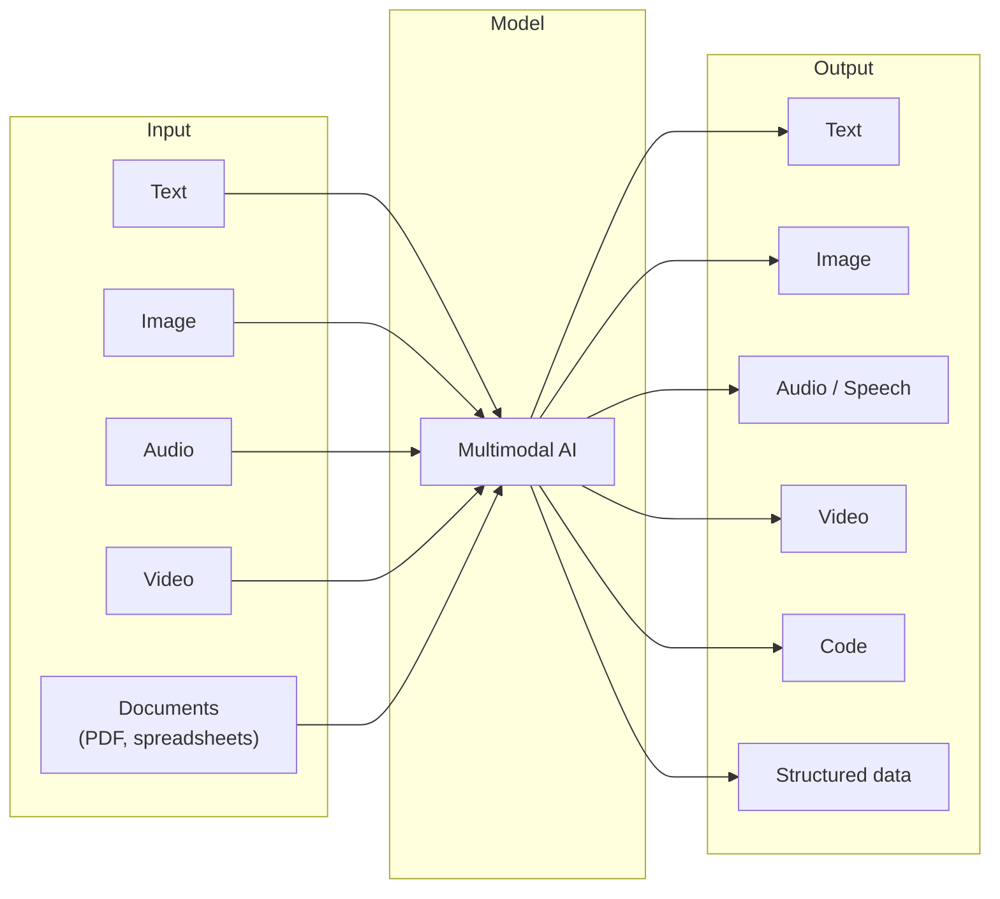

# Module 4: Multimodal AI

## Beyond text

Most AI product discussions focus on text — LLMs, prompts, RAG. But a growing share of AI product opportunities involve other modalities: images, audio, video, and combinations of these. Understanding what's possible with each modality, what the quality bar is today, and where the rough edges are is increasingly important for product decisions.

This module is a PM-level survey of multimodal AI: what each modality can do, where it's production-ready, and what to spec differently when building with it.

---

## The modality map

Not every combination is available or production-ready. The following sections map the current state.

---

## Vision: image and document understanding

### What it can do (production-ready)

**Image understanding:**
- Describe what's in an image in detail
- Answer questions about image content ("Is there a stop sign in this photo?")
- Extract text from images (OCR) — charts, screenshots, handwriting
- Identify objects, people, scenes, and relationships
- Compare two images and describe differences
- Analyze UI screenshots and describe the layout

**Document understanding:**
- Read and answer questions about PDFs, including those with tables and charts
- Extract structured data from forms, invoices, receipts
- Process scanned documents (not just text-layer PDFs)
- Understand charts and graphs — describe trends, extract data points

**Models:** Claude (Sonnet, Opus), GPT-4o, Gemini 1.5 Pro. All handle images and documents natively via API.

---

### What it can't do reliably

- Precise spatial reasoning ("how many centimetres is X from Y in this image")
- Reliable counting of many objects in complex scenes
- Consistent face recognition (and most providers restrict this intentionally)
- Reading very small, degraded, or stylized text with high accuracy
- Understanding video (most models process images, not video frames at scale)

---

### PM implications for vision features

**Input constraints to spec:**
- Max image size (varies by provider — typically 5–20MB)
- Supported formats (JPEG, PNG, GIF, WebP are standard)
- Number of images per request (check provider limits)
- What happens when the image is too low quality to interpret

**Cost:** Vision requests cost more than text-only requests — roughly 2–5× depending on image size and model. Include image dimensions in cost estimates.

**Privacy:** Images often contain more sensitive data than text (faces, locations in metadata, visible documents). Spec data handling carefully. Consider whether images need to be stripped of metadata before sending to an API.

**Key product use cases:**
- Invoice and receipt processing
- Quality control (flag defects in product photos)
- Accessibility (generate alt-text for images)
- Document digitization and extraction
- UI testing and screenshot analysis
- Medical imaging (with significant regulatory caution)

---

## Audio: speech-to-text and text-to-speech

### Speech-to-text (transcription)

**What it can do:**
- Transcribe spoken audio to text with high accuracy across many languages
- Speaker diarization — identify and label different speakers ("Speaker 1:", "Speaker 2:")
- Generate word-level timestamps (useful for syncing transcripts to audio)
- Handle accents, background noise, and domain-specific vocabulary reasonably well

**Production-ready models:** OpenAI Whisper (open source, self-hostable), AssemblyAI (API, adds diarization and intelligence), Deepgram (API, low latency, real-time capable)

**Use cases:**
- Meeting transcription and summarization
- Customer call analysis
- Voice interface input (transcribe before sending to LLM)
- Accessibility (live captions)
- Podcast/video content processing

---

### Text-to-speech (voice generation)

**What it can do:**
- Generate natural-sounding speech from text
- Clone a voice from a short audio sample (voice cloning)
- Control speaking style, pace, and tone
- Generate multiple languages and accents
- Real-time streaming synthesis (low latency for conversational use)

**Production-ready models:** ElevenLabs, OpenAI TTS, PlayHT, Cartesia (optimized for real-time/low-latency)

**Use cases:**
- Voice interfaces and assistants
- Accessibility (read content aloud)
- Localization (generate voiceovers in multiple languages)
- Automated customer call handling
- Podcast and video production

**Voice cloning — the PM caution:** Voice cloning capabilities raise significant consent and misuse concerns. Before building features that clone real people's voices, establish explicit consent requirements, use-case restrictions in your terms, and audit logging for cloned voice usage. Regulatory exposure here is real.

---

### Audio quality considerations

| Factor | PM implication |
|--------|---------------|
| **Latency** | Real-time voice requires <500ms end-to-end. Batch transcription can be async. Spec which you need. |
| **Audio quality** | Transcription accuracy drops significantly with low-quality audio. Define minimum quality requirements. |
| **Language support** | Check specific language coverage — accuracy varies significantly by language. Test your target languages. |
| **Speaker count** | Diarization quality degrades with many simultaneous speakers. Know your use case's typical speaker count. |

---

## Image generation

**What it can do:**
- Generate photorealistic images from text descriptions
- Edit existing images (inpainting — change parts of an image)
- Extend images beyond their borders (outpainting)
- Generate images in specific styles
- Generate variations of an existing image
- Remove backgrounds, swap objects

**Production-ready models:** DALL-E 3 (OpenAI API), Imagen (Google), Stable Diffusion (open source, self-hostable), Midjourney (API available), Ideogram, Flux

**Use cases:**
- Product mockups and concept visualization
- Marketing asset generation
- Personalized visual content
- Game and creative asset production
- Rapid prototyping of visual designs

---

### Image generation: the PM considerations

**Quality vs. consistency:** Generated images are creative and variable. They're not deterministic — the same prompt produces different images each time. If your use case requires brand consistency, this is a significant challenge.

**Copyright and IP:** Training data lawsuits against image generators are ongoing. Know your vendor's stance on copyright indemnification before using generated images commercially.

**Content policy:** All major providers have content policies that restrict certain types of imagery. Understand these before building features that rely on image generation — user requests will hit these limits.

**Moderation:** If users can input prompts, they will attempt to generate inappropriate content. Build content moderation on inputs, not just outputs.

---

## Video AI

Video AI is earlier in its maturity curve than image or audio. As of 2025:

### What's production-ready
- **Video-to-text:** Transcription and summary of video content (via audio track + optional frame analysis)
- **Video understanding:** Some models can analyze video clips and answer questions about content
- **Basic video generation:** Short clips (5–20 seconds) from text prompts with reasonable quality

### What's not yet reliable at scale
- Long-form video generation with narrative consistency
- Video editing via natural language at production quality
- Real-time video processing at low latency

**Models to watch:** Sora (OpenAI), Veo (Google), Runway Gen-3, Kling

**PM stance on video generation:** Strong for creative and marketing use cases. Not yet reliable enough for anything requiring consistency, brand accuracy, or factual representation. Treat as experimental unless you've validated quality for your specific use case.

---

## Combining modalities: where product opportunities emerge

The most interesting PM opportunities are often at the intersection of modalities:

| Combination | Use case example |
|------------|-----------------|
| Image + Text → Text | "What's in this invoice? Extract as JSON" |
| Audio + Text → Text | Meeting transcript + AI summary + action items |
| Text + Text → Audio | Documentation → spoken tutorial |
| Image + Text → Image | "Edit this product photo to remove the background" |
| Document + Text → Text | "Summarize this 50-page PDF and answer questions about it" |
| Audio + Text → Text + Actions | Voice command → transcribe → LLM intent → tool call |

---

## Speccing multimodal features: what's different

When writing specs for features that use non-text modalities:

**Input spec additions:**
- File format requirements and restrictions
- Size/duration limits
- Quality minimums (resolution, bitrate)
- What happens when input doesn't meet requirements

**Output spec additions:**
- For generated media: resolution, format, duration limits
- For extraction: what structured format does the extracted data take?
- For transcription: timestamps? Speaker labels? Confidence scores?

**Cost model:**
- Audio: typically priced per minute of audio
- Images: priced per image or per token equivalent (larger images = more tokens)
- Video generation: priced per second of generated video (expensive)

**Latency model:**
- Transcription of a 1-hour recording: 1–5 minutes async
- Real-time transcription: ~200–500ms per utterance
- Image generation: 5–30 seconds per image
- Video generation: minutes to hours per clip

---

## PM Decision Checklist — Module 4

- [ ] Which modalities does this feature involve? Have I specced input formats, size limits, and quality requirements?
- [ ] Is the modality capability I'm building on production-ready for my use case, or experimental?
- [ ] Have I tested the chosen model on my actual data (not vendor demos)?
- [ ] For vision: have I accounted for the higher cost vs. text-only and the privacy implications of image data?
- [ ] For audio: is this real-time (low-latency) or async? Have I checked language coverage for my target users?
- [ ] For voice cloning: is there explicit consent, use-case restriction, and audit logging?
- [ ] For image generation: have I addressed copyright risk, content policy limits, and the consistency challenge?
- [ ] For video: am I treating this as production-ready or experimental? Is the risk tolerance appropriate?
- [ ] Have I modeled cost and latency for the chosen modality at expected volume?
