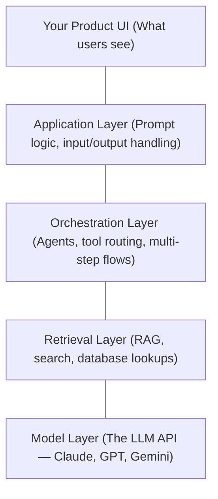
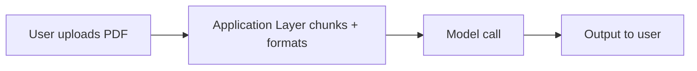
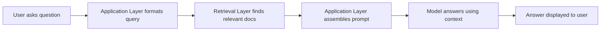
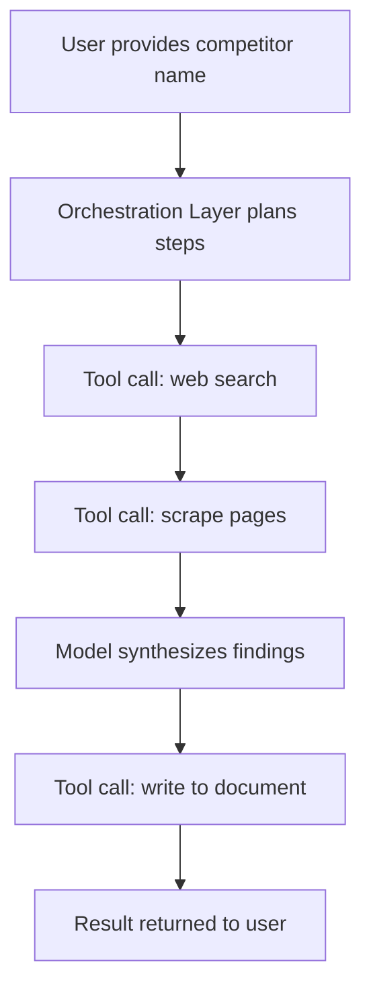

# Module 6: The AI Product Stack

## The layers every AI product has

When someone says "we're adding AI to this feature," they're describing a full system — not a single component. Every AI product is built from layers, and bugs, costs, and failures can originate at any of them. As a PM, you need to know what each layer does so you know what to spec, what to question, and where problems are coming from.

---

## Layer 1: The Model Layer

**What it is:** The LLM itself, accessed via API. You send text in, you get text back. The model has no memory between calls unless you explicitly include history in the context.

**What you control:** Which model you call, how much context you send, temperature settings, output format constraints.

**Where it fails:** Hallucination, inconsistency, high cost if overused, latency.

**PM questions to ask:**
- Which model tier are we using and why?
- Are we using structured output (JSON mode) or free-form text?
- What happens when the API is down or rate-limited?

---

## Layer 2: The Retrieval Layer

**What it is:** The system that finds relevant information before the model call. This could be:
- A vector database (semantic search — finds conceptually similar content)
- A traditional keyword search
- A database query
- An API call to a live data source

**What you control:** What data gets indexed, how it's chunked and retrieved, how much retrieved content goes into the prompt.

**Where it fails:** Retrieving irrelevant content (model answers off-topic), missing content (model says it doesn't know when it should), stale data (content not re-indexed after updates).

**PM questions to ask:**
- What data sources feed the retrieval layer? Who owns keeping them fresh?
- How do we handle a query where retrieval returns nothing useful?
- Is retrieval accuracy being measured separately from model quality?

---

## Layer 3: The Orchestration Layer

**What it is:** The code that manages multi-step AI workflows. This is what makes something "agentic" — the system can call the model multiple times, use tools, branch based on outputs, and run tasks in sequence or parallel.

Orchestration frameworks include: LangChain, LlamaIndex, Claude's tool use API, or custom code.

**What you control:** The sequence of steps, what tools are available, when to loop, when to stop, how to handle errors mid-flow.

**Where it fails:** Cost explodes if loops run unchecked; hard to debug when something goes wrong in step 4 of 7; reliability decreases with each additional step.

**PM questions to ask:**
- How many model calls does a single user action trigger?
- What are the guardrails on loops or retries?
- How does the system fail gracefully if an intermediate step produces bad output?

---

## Layer 4: The Application Layer

**What it is:** The code that handles prompt construction, user input processing, and output formatting. This is where most of the product logic lives — your system prompt, how you format user input before sending it to the model, how you parse and validate what comes back.

**What you control:** The system prompt, how context is assembled, what gets sanitized, how model output is transformed before showing to users.

**Where it fails:** Prompt injection attacks (malicious user input hijacks the model's behavior), inconsistent output parsing, no validation of model responses.

**PM questions to ask:**
- Where is the system prompt stored and who can change it? Is it versioned?
- Are we validating model output before rendering it to users?
- Can users manipulate the model's behavior through their input?

---

## Layer 5: The Product UI

**What it is:** How users experience the AI feature. Streaming responses, loading states, feedback mechanisms, error messages, confidence indicators, and escalation paths (when AI fails, what does the user do next?).

**What you control:** The UX design decisions — this is your primary domain.

**Where it fails:** Users don't understand what the AI can/can't do; no feedback loop for bad outputs; streaming creates awkward UX if not handled carefully.

---

## How these layers combine: three common patterns

### Pattern A: Simple Augmentation
**Example:** A "summarize this document" button.

Layers involved: Model + Application + UI.
**Complexity:** Low. No retrieval or orchestration needed.

---

### Pattern B: RAG-powered Q&A
**Example:** "Ask questions about your company knowledge base."

Layers involved: Model + Retrieval + Application + UI.
**Complexity:** Medium. The hard part is retrieval quality.

---

### Pattern C: Agentic Workflow
**Example:** "Research this competitor and write a brief."

Layers involved: All five.
**Complexity:** High. Each tool call is a failure point. Cost and latency multiply.

---

## The build vs. buy decision

At each layer you can build or buy:

| Layer | Build option | Buy/use option |
|-------|-------------|----------------|
| Model | Fine-tune your own | Claude, GPT-4, Gemini APIs |
| Retrieval | Build vector search | Pinecone, Weaviate, pgvector |
| Orchestration | Custom code | LangChain, LlamaIndex, Claude tool use |
| Application | Custom prompts + code | Prompt management platforms |
| UI | Build your own | Streaming SDKs, component libraries |

**Rule:** Buy infrastructure layers (model, retrieval, orchestration) unless you have a specific reason the commodity solution won't work. Build application and UI layers — that's where your product differentiation lives.

---

## PM ownership by layer

Across all five layers, PMs define the "what" and "why." Engineering implements the "how." But the split is not equal — some layers demand sustained PM involvement, others are largely engineering territory after the initial requirements are set.

| Layer | PM Owns | Engineering Owns |
|-------|---------|-----------------|
| **Model Layer** | Model tier selection, cost-per-query budget, latency requirements, fallback requirements | API integration, retry logic, token counting, provider management |
| **Retrieval Layer** | What data gets indexed, freshness requirements, access control rules, "I don't know" behaviour | Vector DB infrastructure, chunking strategy, embedding pipeline, re-indexing automation |
| **Orchestration Layer** | Skill definitions, routing rules, how errors are surfaced to users, max steps per workflow | Orchestration framework, prompt assembly code, tool coordination, loop guards |
| **Application Layer** | System prompt content, output format requirements, failure message copy, versioning policy | Prompt storage, output validation code, session management, rate limiting infrastructure |
| **Product UI** | Interaction pattern, how uncertainty is communicated, feedback mechanisms, escalation paths | Component implementation, streaming, frontend code |

---

## Change impact by layer

Changes you initiate as a PM ripple through the stack in predictable ways. Use this table to understand the blast radius before requesting a change — and to know what PM action is needed alongside engineering work.

| Change Type | Layers Affected | PM Action Required |
|-------------|----------------|-------------------|
| **Model version swap** (e.g., upgrading to a newer model release) | Model Layer, possibly Application Layer (output format differences) | Re-run evals; validate output quality didn't shift; update latency and cost estimates |
| **System prompt edit** | Application Layer | Version the change; run regression evals; confirm no guardrail behaviours changed inadvertently |
| **RAG index update** (new documents added, old ones removed) | Retrieval Layer, Application Layer (context assembly changes) | Test retrieval quality on affected query types; confirm access controls still apply correctly |
| **New tool added** | Orchestration Layer, Application Layer | Spec the tool description carefully (model uses it for routing decisions); define failure behaviour; confirm approval flow if tool has write access |
| **UI change** (new interaction surface, new output format) | Product UI, possibly Application Layer (output format must match) | Spec new output format requirements; update system prompt if format changes; validate with users |

---

## PM Decision Checklist — Module 6

When a new AI feature lands on your roadmap:

- [ ] Which of the three patterns does this map to? (Augmentation / RAG / Agentic)
- [ ] Have I identified which layers are involved and who owns each?
- [ ] Is there a retrieval layer? If so: what data, who keeps it fresh, how do we test quality?
- [ ] If orchestration is involved: what's the max number of model calls per user action? What's the error handling?
- [ ] Where is the system prompt? Is it versioned? Who can edit it?
- [ ] Have I specced the failure states at the UI layer — not just the happy path?
- [ ] At each layer, are we building or buying? Is the decision justified?
