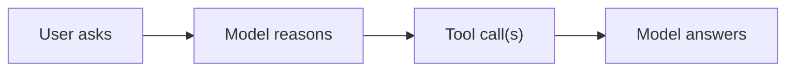
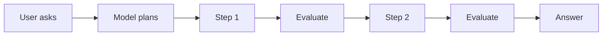
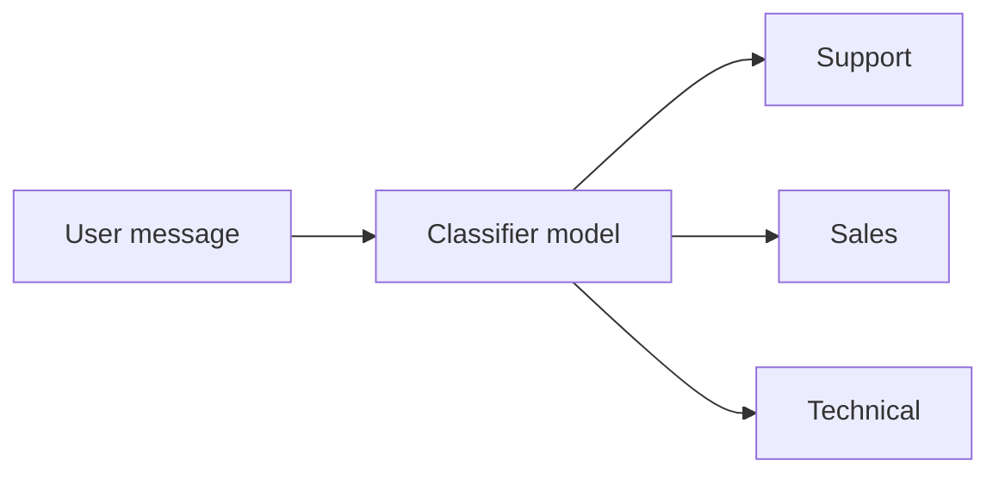
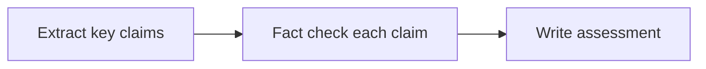
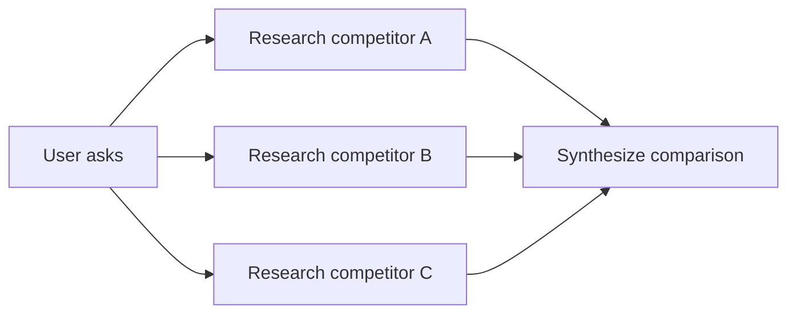
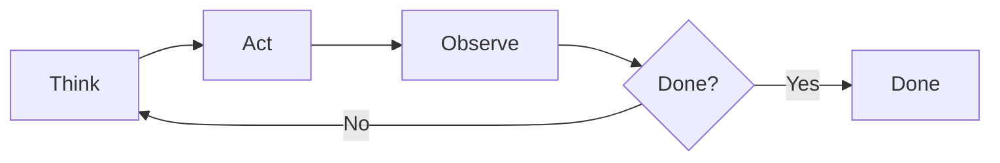
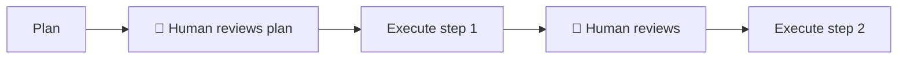

# Module 7: Agents and Tool Use

## What "agentic" actually means

The word "agent" is overused. Technically, an AI agent is a system where:
1. The model can **use tools** (take actions beyond generating text)
2. The model can **run multiple steps** (its output determines what happens next)
3. The model has some **autonomy** in deciding what to do

A chatbot that answers questions is not an agent. A system that can search the web, read documents, write files, and send emails — and decides how to sequence those steps — is an agent.

**For product purposes:** An agent is any AI feature where a single user request triggers multiple model calls and/or real-world actions.

---

## Tool use: the foundation of agentic behavior

Tools (also called "function calling") let the model request that an external system perform an action and return a result. The model generates a tool call; your code executes it; the result goes back to the model.

**Example flow:**
```
User: "What's the weather in Tokyo?"

Model → tool call: get_weather(location="Tokyo")
System executes → returns {"temp": 18, "condition": "cloudy"}
Model → "It's 18°C and cloudy in Tokyo right now."
```

The model never touches the weather API directly. It just asks for it. Your code does the actual work.

**Common tools in production systems:**

| Tool type | Examples |
|-----------|---------|
| Data retrieval | Search knowledge base, query database, read file |
| External APIs | Get weather, fetch stock price, check calendar |
| Web | Search the internet, scrape a URL |
| Actions | Send email, create calendar event, update record |
| Computation | Run code, calculate, execute SQL |
| File operations | Read, write, create, delete files |

---

## The model context protocol (MCP)

MCP is an open standard (Anthropic-led) that defines how AI models connect to tools and data sources. Instead of every team hardcoding tool integrations, MCP lets any compliant tool be plugged into any compliant model system.

**Think of it like:** USB for AI tools. Build a tool once as an MCP server, and it works with any MCP client.

**Why this matters for you:** If you're building internal tools or workflows, implementing them as MCP servers means they become available to any AI assistant your team uses — not just one specific product.

You've already seen this in Claude Code, which uses MCP extensively to connect to browser control, file systems, web search, etc.

---

## Single-step vs. multi-step agents

### Single-step tool use (low complexity)

The model makes one or a few tool calls, gets results, and answers. Predictable, cheap, fast.



**Examples:**
- Q&A with web search ("look this up for me")
- Data extraction from a document
- Generating a draft, then saving it to a file

---

### Multi-step agents (higher complexity)

The model plans a sequence of actions, executes them, evaluates results, and adjusts. Each step's output feeds the next.



**Examples:**
- "Research this market, write a brief, and email it to me"
- "Find all invoices over $10k from last quarter, flag the ones that are overdue, and create a summary report"
- "Review this PR, check our style guide, and post comments"

**The reliability problem:** Each additional step introduces another failure point. A 5-step agent where each step is 90% reliable has a 59% end-to-end success rate. Real-world reliability is usually lower.

---

## Agentic system design patterns

### Pattern 1: Router/Classifier
The model looks at the input and routes it to the right sub-system.



**Use when:** You have multiple distinct workflows and need to decide which to run.

---

### Pattern 2: Sequential Pipeline
Steps run in order, output of each feeds the next. Often called a "chain."



**Use when:** The task has a natural sequence where each step depends on the previous.

---

### Pattern 3: Parallel Execution
Multiple tasks run simultaneously, results are merged.



**Use when:** Subtasks are independent and speed matters. This is how the `competitive-analyst` agent in pm-claude-kit works.

---

### Pattern 4: ReAct Loop (Reason + Act)
The model reasons about what to do, acts, observes the result, reasons again. Repeats until done.



**Use when:** The path to completion isn't known upfront (research tasks, debugging, open-ended exploration).

**Risk:** Without guardrails, this can loop indefinitely or take unexpected detours.

---

### Pattern 5: Human-in-the-Loop
The agent pauses at defined points and waits for human approval before proceeding.



**Use when:** Actions are irreversible (sending emails, deleting data, making purchases) or high-stakes (customer-facing outputs, financial actions).

This is the most important pattern for most business applications. Default to human-in-the-loop for anything that touches external systems or can't be easily undone.

---

## When NOT to use agents

Agents are often the wrong answer. Before speccing an agentic feature, check if a simpler approach works:

| You want | Consider first |
|----------|---------------|
| Answer a question | Single LLM call with RAG |
| Extract data from documents | Structured output from a single call |
| Classify input | Fine-tuned classifier or single call |
| Draft content | Single call with a good prompt |
| Run a defined process | Hardcoded workflow with LLM steps where needed |

Use agents when:
- The path through the task isn't fully known upfront
- The task genuinely requires multiple different tools
- The task is too long/complex for one context window
- Parallel execution provides significant speed benefit

---

## Cost and latency: the agent multiplier

Every additional model call in an agent multiplies your cost and latency.

**Example calculation:**
- Single Sonnet call: ~$0.003, ~2 seconds
- 5-step agent with 5 Sonnet calls: ~$0.015, ~10 seconds
- 5-step agent with 2 web searches + 3 Sonnet calls: ~$0.009 + web search cost, ~20–30 seconds

Always ask: "How many model calls does a single user action trigger in the worst case?" If the answer is unbounded, there's a problem.

---

## PM Decision Checklist — Module 7

- [ ] Is this genuinely agentic, or could a simpler single-call design work?
- [ ] Which pattern applies: router, sequential, parallel, ReAct loop, or human-in-the-loop?
- [ ] What tools does the agent have access to? Are any of them destructive or irreversible?
- [ ] What's the maximum number of model calls per user action? What enforces that limit?
- [ ] Where are the human-in-the-loop checkpoints? Any irreversible action should have one.
- [ ] How does the system fail gracefully when a mid-flow step returns bad results?
- [ ] What's the expected latency? Is that acceptable to users?
- [ ] Have I estimated cost per workflow execution and is it sustainable at expected volume?
