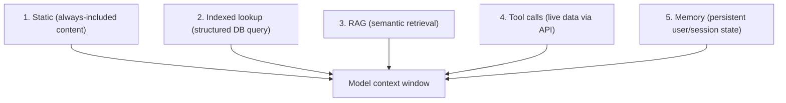
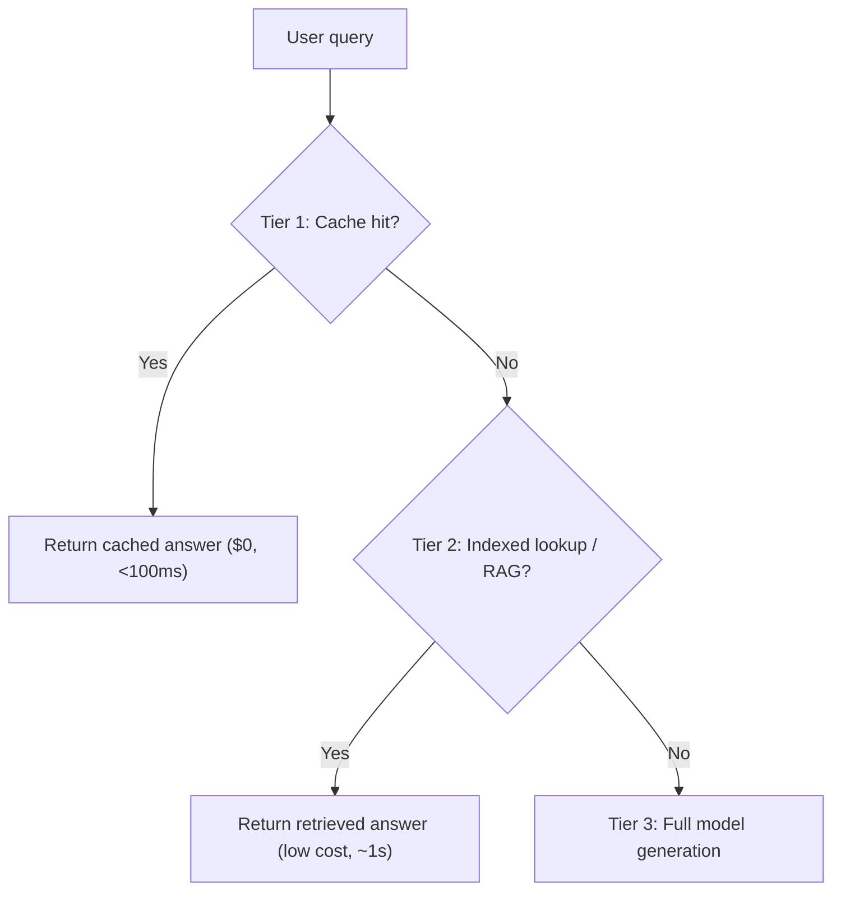

# Module 7: RAG and Context Architecture

## The bigger picture: context as the product

Here's a frame that will change how you think about AI products: **the model is the commodity. The context is the product.**

Most teams have access to the same foundation models. What differentiates one AI product from another is what each one puts *into* the model's context — the data, the instructions, the retrieved documents, the user state, the tool results. That's where the product lives. RAG is one of five strategies for getting context in front of the model. This module starts with all five, then goes deep on RAG (the most common), and ends with how to choose between them.

---

## The 5 context strategies



### Strategy 1: Static context
Content baked into the system prompt that's the same for every request. Brand voice, role definition, output format, few-shot examples, fixed knowledge that doesn't change.

**Best for:** Stable instructions, persona, formatting rules, small amounts of always-relevant knowledge.

**When it breaks:** When the static content gets large enough to bloat every request, or when it conflicts with retrieved content.

---

### Strategy 2: Indexed lookup
A structured database query — fetch this user's account, this product's spec, this order's status. Fast, deterministic, exactly the right record.

**Best for:** Known schemas, exact matches, real-time data with stable structure.

**Why teams underuse it:** They reach for RAG when a SQL query would work. RAG is fuzzy; indexed lookup is precise. If you know exactly what you need, look it up — don't search for it.

---

### Strategy 3: RAG (Retrieval-Augmented Generation)
Semantic search across unstructured content. Find chunks similar in meaning to the query, even if the wording differs.

**Best for:** Unstructured docs, knowledge that doesn't fit a schema, "answer questions about X" patterns.

**Limitations:** Imprecise (might retrieve the wrong chunks), expensive infrastructure (vector DBs, re-indexing), and the most common failure point in AI systems.

---

### Strategy 4: Tool calls
The model requests live data or actions from external systems — call an API, run a query, send a message. Module 8 covers this in depth.

**Best for:** Real-time data (prices, inventory, calendar), live actions (creating records, sending emails), capabilities that can't be pre-indexed.

**The rule:** If the data changes faster than you'd want to re-index, use tools, not RAG.

---

### Strategy 5: Memory
Persistent user or session state — the AI's "long-term memory" of past interactions, preferences, learned facts. More complex than the other four; usually built on top of them.

**Best for:** Personalisation, continuity across sessions, learning from past corrections.

**The hard parts:** What to remember, when to forget, how to surface relevant memories at the right time.

---

## The Tiered Resolution Pattern

Real AI products usually combine multiple strategies in a layered approach. The pattern: **try the cheapest, fastest path first; escalate only when needed.**



**Cost economics example:**
- Tier 1 (cache): $0 per request, <100ms
- Tier 2 (retrieval-only with cached prompt): $0.002 per request, ~1s
- Tier 3 (full generation): $0.015 per request, ~5s

Even if 30% of queries can be answered at Tier 1 or Tier 2, you've cut costs significantly without sacrificing quality on the harder queries. PM implication: don't design AI features so every query takes the most expensive path. Design tiered resolution from the start.

---

## What RAG is and why it exists

**RAG** stands for Retrieval-Augmented Generation. It's the standard architecture for building AI features that need to answer questions about your data — your product docs, customer history, knowledge base, contracts, anything that isn't baked into the model's training.

The problem it solves: LLMs have a training cutoff and don't know your private data. You could dump everything into the context on every call, but that's expensive, slow, and the model loses focus. Instead, RAG finds the most relevant pieces of information first, then gives only those to the model.

**Before RAG:**
```
User: "What does our enterprise plan include?"
Model: [makes up a plausible-sounding answer based on training data]
```

**With RAG:**
```
User: "What does our enterprise plan include?"
System: [searches knowledge base, retrieves the enterprise plan page]
Model: "Based on your enterprise plan documentation: [accurate answer]"
```

---

## The three steps of a RAG system

### Step 1: Indexing (done once, then maintained)

Your content is processed and stored in a way that makes it fast to search:

1. **Chunking** — Documents are split into smaller pieces (chunks). A typical chunk is 200–500 words. Chunking strategy matters: too small and chunks lose context; too large and retrieval becomes imprecise.

2. **Embedding** — Each chunk is converted into a vector (a list of numbers) that represents its semantic meaning. Similar meaning = similar vectors. This is done by an embedding model (a different, smaller model than the LLM).

3. **Storage** — Vectors are stored in a vector database (Pinecone, pgvector, Weaviate, etc.) alongside the original text.

**PM implications:**
- Indexing takes time to set up and time to run at scale
- When source content changes, it needs to be re-indexed — who owns this?
- The chunking strategy is a product decision, not just a technical one (e.g., chunk by section? by paragraph? keep tables intact?)

---

### Step 2: Retrieval (at query time)

When a user asks a question:

1. The question is embedded into a vector (same embedding model as indexing)
2. The vector database finds the N most similar chunks (cosine similarity)
3. Those chunks are returned as candidates

**Retrieval strategies:**
| Strategy | How it works | Best for |
|----------|-------------|----------|
| **Dense retrieval** | Semantic vector search | "What does X mean?" style questions |
| **Sparse retrieval** | Keyword matching (BM25) | Exact terms, product codes, names |
| **Hybrid retrieval** | Combines both | Most production systems |
| **Reranking** | Second pass to re-score candidates | When precision matters more than speed |

**PM implications:**
- Retrieval quality is the #1 failure point in RAG systems. Most RAG failures are retrieval failures, not model failures.
- You need a way to test retrieval independently of the model (can the system find the right chunk when given a question you know the answer to?)
- "N" (how many chunks to retrieve) is a tunable parameter — more = more likely to find relevant content, but also more noise for the model

---

### Step 3: Generation

The retrieved chunks are assembled into the prompt:

```
System: You are a helpful assistant. Answer questions using only the provided context. 
If the answer isn't in the context, say you don't know.

Context:
[Chunk 1: Enterprise plan features...]
[Chunk 2: Plan comparison table...]
[Chunk 3: Pricing FAQ...]

User: What does our enterprise plan include?
```

The model answers using the retrieved content.

**PM implications:**
- The instruction "only use the provided context" is important — without it, the model will blend retrieved content with trained knowledge unpredictably.
- Prompting the model to say "I don't know" when context is absent is a design choice you must make explicitly — it won't do this by default.

---

## Key RAG product decisions

### What to index?

Everything you want the model to be able to answer questions about. Common sources:
- Product documentation
- Help articles / FAQs
- Internal wikis
- PDFs (contracts, reports)
- Database records (via structured retrieval)
- Email/Slack history (with appropriate access controls)

**Don't index everything by default.** More data = more noise = lower retrieval precision. Index what users will actually ask about.

---

### Freshness: how current does the data need to be?

| Data type | Acceptable staleness | Re-indexing strategy |
|-----------|---------------------|---------------------|
| Product docs | Hours to days | Re-index on publish |
| Pricing | Minutes to hours | Webhook-triggered re-index |
| Customer records | Real-time | Direct DB query, not RAG |
| Knowledge base | Days | Nightly batch |

If data needs to be real-time (prices, inventory, live status), RAG is the wrong tool — use direct database queries as a tool call instead.

---

### Access control: who can see what?

This is a security requirement that's easy to miss. If different users should only see certain documents, the retrieval layer must enforce this — not just the model.

**Failure mode:** User A's documents leak into User B's answers because the vector database has no user-level filtering.

Always spec: "The retrieval layer must only return chunks the current user has permission to access."

---

### Handling "I don't know"

Design explicitly for what happens when retrieval returns nothing relevant:

- Does the model say "I don't have information on that"?
- Does it fall back to a different flow?
- Does it escalate to a human?

If you don't spec this, engineers will default to letting the model guess — which is usually wrong.

---

## Common RAG failure modes (and what to do about them)

| Failure | Symptom | Fix |
|---------|---------|-----|
| Wrong chunks retrieved | Model answers a different question than was asked | Improve chunking strategy; add metadata filters; use hybrid retrieval |
| Chunks lack context | Answer is technically in a chunk but the model misses it | Larger chunks; include surrounding context |
| Stale content | Model gives outdated answers | Automated re-indexing on content change |
| Hallucination despite retrieval | Model ignores context and makes things up | Stronger system prompt instruction; reduce temperature; use citations |
| Slow retrieval | High latency | Cache popular queries; use approximate nearest neighbor search |

---

## RAG vs. alternatives: when to use what

| You need | Use |
|----------|-----|
| Answer questions about docs you own | RAG |
| Access live/real-time data | Tool call to API or database |
| Answer using a small, fixed set of facts | Just put them in the system prompt |
| Deep personalization based on user history | RAG + user-scoped index |
| Knowledge that rarely changes | System prompt or fine-tuning |

---

## PM Decision Checklist — Module 7

- [ ] What data sources need to be indexed? Who owns maintaining them?
- [ ] How fresh does the data need to be? What triggers re-indexing?
- [ ] Are there access control requirements? Is the retrieval layer enforcing them?
- [ ] How are we measuring retrieval quality independently of model quality?
- [ ] What happens when retrieval returns nothing? Is there a defined fallback?
- [ ] Is hybrid retrieval needed, or does vector search alone work for this use case?
- [ ] Are we using direct tool calls instead of RAG for any real-time data needs?
