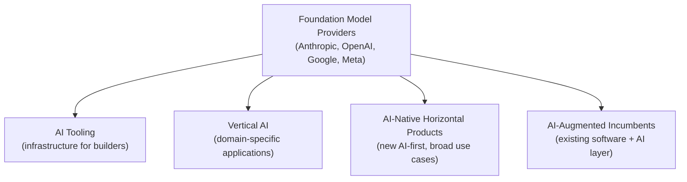
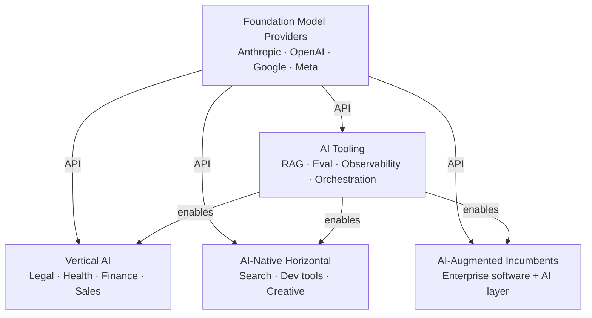

# Module 9: The AI Product Landscape

## Why the taxonomy matters

Knowing where your product sits in the AI landscape shapes nearly every product decision: who your competitors are, how users will calibrate their trust, what technical patterns apply, and where defensibility comes from. Two products that both use LLMs can have completely different dynamics depending on which category they occupy.

This module maps the landscape and draws out the PM implications of each category.

---

## The five categories

Each category sits on top of the foundation model layer. The arrow represents dependency, not hierarchy of value.

---

## Category 1: Foundation Model Providers

**What they are:** The companies training and serving the base models. Everything else in the stack is built on top of them.

**Examples:** Anthropic (Claude), OpenAI (GPT-4, o3), Google (Gemini), Meta (Llama — open source), Mistral, xAI (Grok)

**Business model:** API usage (tokens consumed), plus consumer subscriptions (ChatGPT Plus, Claude.ai Pro).

**Competitive dynamics:**
- Compete on capability benchmarks, safety, speed, and price
- High capex moat (training runs cost hundreds of millions)
- Commoditization pressure is real — models are converging in capability, differentiation is shifting to ecosystem, trust, and specialization
- Open-source models (Llama) pressure pricing and create self-hosting options for enterprise

**PM implications if you're building on this layer:**
- Model capability is improving faster than any roadmap can track — build your product around the tasks it enables, not the specific model behaviors today
- Your dependency on a foundation provider is a supply chain risk; monitor API terms, pricing changes, and deprecation schedules
- "Model X is better" is a weak moat — your product needs differentiation above the model layer

---

## Category 2: AI Tooling

**What they are:** Infrastructure products that help developers build, deploy, evaluate, and monitor AI applications. They don't deliver end-user value directly — they enable other products to be built.

**Sub-categories:**

| Sub-category | Purpose | Examples |
|-------------|---------|---------|
| Vector databases | Semantic search + retrieval (RAG) | Pinecone, Weaviate, pgvector |
| Observability & monitoring | Trace model calls, track quality | LangSmith, Helicone, Arize |
| Prompt management | Version, test, deploy prompts | PromptLayer, Braintrust |
| Evaluation platforms | Run evals, measure quality | Braintrust, RAGAS, Evals (OpenAI) |
| Orchestration frameworks | Chain model calls, manage agents | LangChain, LlamaIndex |
| Fine-tuning platforms | Train custom models | Together AI, Modal, Replicate |
| Model hosting | Serve open-source models | Replicate, Together AI, Hugging Face |

**Competitive dynamics:**
- Fast-moving; many tools are pre-product-market-fit
- Consolidation happening — developers resist too many point solutions
- Open-source alternatives exist for almost everything (LangChain, pgvector, RAGAS)
- The "picks and shovels" play — revenue tied to growth of the overall AI development market

**PM implications:**
- Evaluate vendor maturity carefully; many tooling companies are early-stage
- Prefer tools with open-source cores where you need long-term control (retrieval, eval)
- Factor tooling cost into your AI infrastructure budget (it adds up on top of model API costs)

---

## Category 3: Vertical AI

**What they are:** AI products purpose-built for a specific industry or workflow. The model is a means to an end; the value is domain-specific — specialized data, workflows, compliance, and integrations that a general-purpose tool won't have.

**Examples:**

| Industry | Product | Core AI capability |
|----------|---------|-------------------|
| Legal | Harvey | Contract review, legal research |
| Healthcare | Abridge, Nabla | Clinical note generation, ambient documentation |
| Finance | Rogo, Klarna AI | Financial analysis, customer support automation |
| Sales | Gong, Chorus | Call analysis, coaching, deal intelligence |
| Recruiting | Ashby AI, Gem | Candidate matching, outreach generation |
| Construction | Procore AI | Project risk, document processing |
| Coding | Cursor, GitHub Copilot | Code generation, inline assistance |

**Why vertical wins:**
- Domain-specific training data and fine-tuning improves quality for niche tasks
- Deep workflow integration (EHR systems, legal databases, CRM) creates stickiness
- Compliance and regulatory expertise (HIPAA, SOC 2, legal privilege) removes a barrier enterprise buyers face with general-purpose AI
- Users in the domain trust a purpose-built tool more than a general one

**Competitive dynamics:**
- Strong beachhead position once a workflow is owned
- Exposed to foundation model providers building verticals themselves (OpenAI entering legal, healthcare)
- Differentiation must go beyond "we use AI" — the moat is data network effects, workflow lock-in, and domain expertise

**PM implications:**
- If you're building vertical AI: go deep on the workflow, not just the model. The AI is table stakes; the integration and UX is the product.
- Identify where proprietary data accumulates in your product — that's your long-term moat
- Compliance requirements in regulated industries (healthcare, finance, legal) are a feature, not a burden — they're a barrier to entry for competitors

---

## Category 4: AI-Native Horizontal Products

**What they are:** New products, built AI-first, that target broad use cases rather than a specific industry. Unlike vertical AI, they serve many different types of users and workflows. Unlike augmented incumbents, they weren't built on a pre-AI product base.

**Examples:**

| Product | Core use case |
|---------|--------------|
| Perplexity | AI-native search and research |
| Cursor | AI-first code editor |
| Notion AI (as a product, not a feature) | AI-first workspace |
| Claude.ai / ChatGPT | General-purpose AI assistant |
| Runway, Midjourney | AI-native creative tools |
| ElevenLabs | AI-native voice/audio |

**What makes them "native":** The AI isn't added on — the entire product experience is designed around AI interaction. There's no non-AI baseline to compare against.

**Competitive dynamics:**
- Directly exposed to foundation model providers, who offer similar capabilities (ChatGPT, Claude.ai)
- Differentiation through UX, specific workflow design, integrations, and specialized fine-tuning
- High user acquisition but retention depends on whether the AI capability is genuinely differentiated
- UX quality matters as much as model quality — most users can't distinguish model performance differences

**PM implications:**
- UX and product design is the primary differentiator — you can't win on model capability alone
- Speed and interaction design create more day-to-day value than marginal accuracy improvements
- Community and ecosystem effects (plugins, templates, sharing) can create network moats the model providers lack

---

## Category 5: AI-Augmented Incumbents

**What they are:** Established software products that have added AI capabilities to their existing product. The AI layer sits on top of (or is woven into) a product that already had users, data, and workflows.

**Examples:**

| Incumbent | AI addition |
|-----------|------------|
| Microsoft 365 | Copilot across Word, Excel, Teams, Outlook |
| Salesforce | Einstein AI across CRM, Service Cloud |
| Notion | Notion AI writing assistance |
| Linear | AI-powered issue triage and summaries |
| Figma | AI design suggestions, auto-layout |
| Intercom | Fin AI customer support agent |
| Zendesk | AI ticket triage and response suggestions |

**Why incumbents have an advantage:**
- Proprietary data: years of user behavior, content, and context already in the system
- Existing workflow integration: users don't need to change tools
- Distribution: existing sales channels, enterprise contracts, and user trust
- Data network effects: more users → more data → better AI → more users

**Competitive dynamics:**
- Incumbents are often faster to capture AI revenue than AI-native startups, because they have the distribution
- Risk: bolted-on AI feels clunky vs. AI-native alternatives — user expectations are rising
- Internal pressure to ship AI features on a marketing timeline, not a quality timeline (this creates PM tension)

**PM implications if this is you:**
- Your data advantage is real — lean into it. What can your AI do that a general-purpose tool cannot, because of your proprietary data?
- Avoid "AI for AI's sake" — adding AI to every feature dilutes the value of the genuinely useful ones
- The biggest risk is shipping a mediocre AI feature that damages trust in a product users already rely on
- Measure AI feature adoption and quality separately from core product metrics — don't let AI noise drown the baseline

---

## How the categories interact

Understanding the full stack helps you anticipate threats and opportunities:

**The expansion threat:** Foundation model providers can and do move up the stack. OpenAI building ChatGPT Enterprise, Anthropic building Claude for Teams — these compete with AI-native horizontal and vertical players.

**The data moat:** The further up the stack you go, the more your competitive position depends on proprietary data and workflow lock-in rather than model capability.

**The commoditization dynamic:** As foundation models improve, tasks that required a specialized vertical product two years ago can now be handled by a general-purpose model with a good prompt. Vertical players must continuously deepen their workflow integration to stay ahead.

---

## Where to play: a PM framing

When evaluating where to position an AI feature or product:

| If your strength is... | Consider... |
|------------------------|-------------|
| Domain expertise + proprietary data | Vertical AI — go deep on the workflow |
| Design + UX + distribution | AI-native horizontal — compete on experience |
| Existing user base + data | AI-augmented — your data is the moat |
| Developer relationships | AI tooling — sell to builders |

---

## PM Decision Checklist — Module 9

- [ ] Which category does my product occupy? Is that a deliberate choice?
- [ ] What is my differentiation above the foundation model layer?
- [ ] Do I have a proprietary data advantage? Where does it accumulate?
- [ ] What's my exposure to foundation model providers expanding into my category?
- [ ] Am I building AI-native or bolting AI onto an existing product? Does the UX reflect that distinction?
- [ ] For AI-augmented features: am I shipping AI because it genuinely improves the workflow, or because of roadmap pressure?
