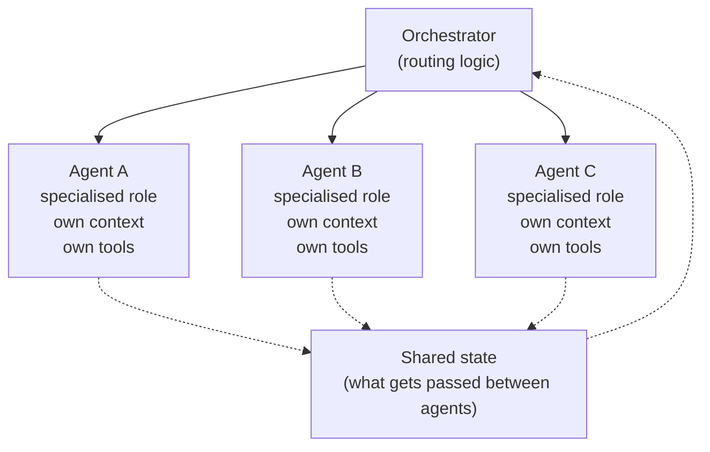
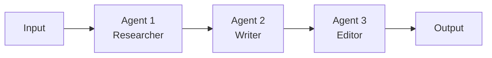
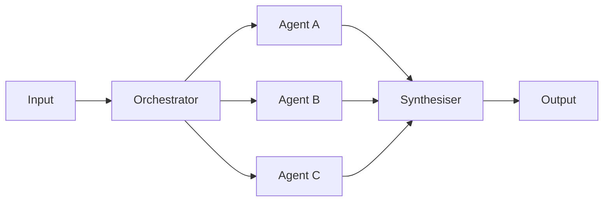
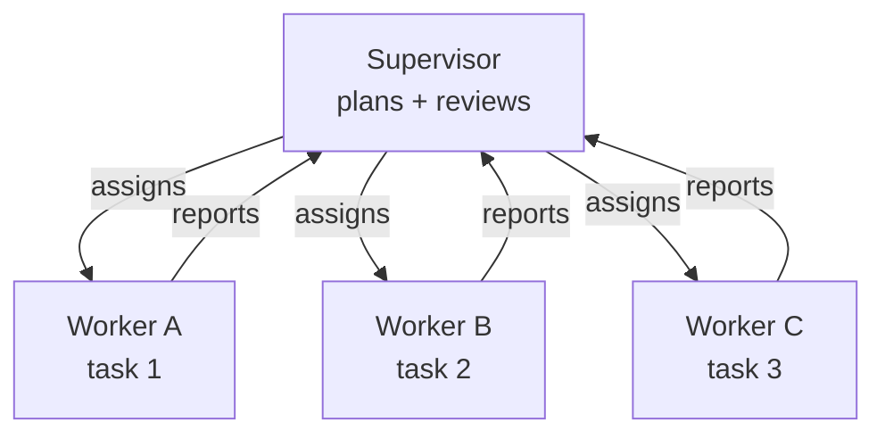
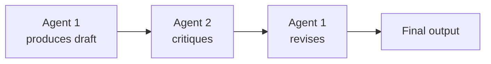
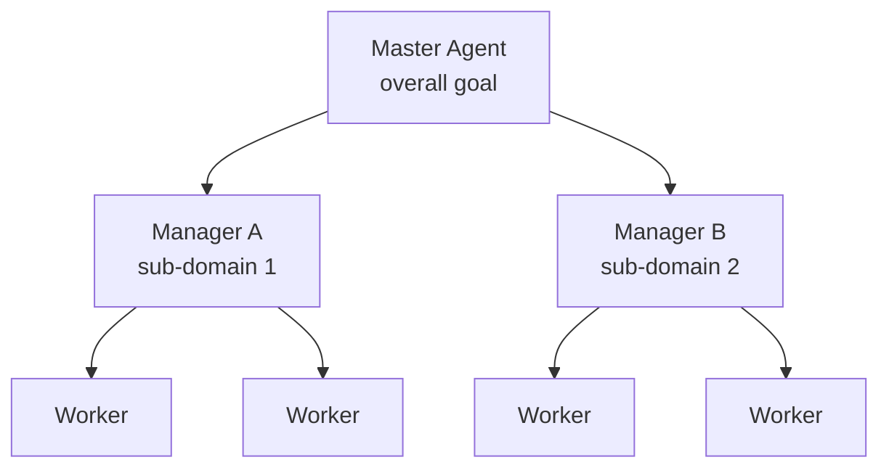

# Module 9: Multi-Agent Architecture

## When one agent isn't enough

Module 8 introduced agents — systems where a model uses tools and runs multiple steps to accomplish a task. For most use cases, a well-designed single agent is the right answer. But there's a class of problems where single-agent quality breaks down, and the solution is to split the work across multiple coordinated agents.

This module covers when to make that move, the five coordination patterns for multi-agent systems, and the tradeoffs PMs need to understand before signing off on multi-agent designs.

The default position: **don't go multi-agent unless you have a specific reason to.** Multi-agent systems are more expensive, slower, harder to debug, and have more failure modes. They're justified only when the alternative is worse.

---

## Signals that single-agent is breaking down

Move to multi-agent when you see these patterns in a single-agent system:

| Signal | What it means |
|--------|--------------|
| **Context window saturation** | The agent's context fills up before the task completes; earlier instructions get lost |
| **Role confusion** | The agent has too many responsibilities and conflates them (e.g., it both critiques and writes, and the critiques drift into the writing) |
| **Tool sprawl** | The agent has access to so many tools that it picks the wrong one or gets confused about when to use which |
| **Quality degradation on long tasks** | Performance is fine on short tasks but degrades on multi-step workflows |
| **Need for parallel execution** | Subtasks are independent and could be done simultaneously, but the single agent does them sequentially |
| **Permission boundaries** | Different parts of the task need different access levels (e.g., one part reads sensitive data, another sends external emails) |

If none of these apply, stay with single-agent. Adding agents because "multi-agent sounds more sophisticated" is a common — and expensive — mistake.

---

## What makes multi-agent different

A multi-agent system isn't just multiple model calls. It has three properties that distinguish it:

**1. Agent isolation:** Each agent has its own context window, system prompt, and (often) its own model and tool access. Agent A doesn't see what's in Agent B's context unless it's explicitly passed.

**2. Coordination logic:** Code (or another agent) decides which agent runs when, what gets passed between them, and when to stop. This is the orchestration layer.

**3. Distinct roles:** Each agent has a specialised purpose. They're not interchangeable — splitting one prompt across two agents accomplishes nothing.

---

## The five multi-agent coordination patterns

### Pattern 1: Sequential Handoff
One agent finishes its task, passes its output to the next agent, which uses it as input. Like an assembly line.

**When to use:**
- The task has a natural pipeline (research → draft → edit, or extract → analyse → summarise)
- Each stage benefits from a specialised role and prompt
- You want clear quality gates between stages

**PM considerations:**
- Latency is the sum of all stages — if any stage is slow, the whole pipeline is slow
- A failure mid-pipeline can waste all the work upstream
- Clear pass/fail criteria between stages prevent garbage propagating downstream

**Example:** A contract analysis system where Agent 1 extracts clauses, Agent 2 classifies risk per clause, Agent 3 produces an executive summary.

---

### Pattern 2: Fan-out / Fan-in
Multiple agents work in parallel on independent subtasks; results are gathered and synthesised.

**When to use:**
- Subtasks are genuinely independent (don't depend on each other's outputs)
- Speed matters and parallel execution would help
- You need breadth before depth (gather, then synthesise)

**PM considerations:**
- Cost is N× a single call (N parallel agents)
- Synthesis quality depends heavily on the synthesiser agent — it's the bottleneck
- Define what happens when one fan-out agent fails — wait, retry, or skip?

**Example:** A competitive analysis tool where parallel agents research 5 different competitors, then a synthesiser produces the comparison report. (This is the pattern used by the `competitive-analyst` agent in pm-claude-kit.)

---

### Pattern 3: Supervisor / Worker
A supervisor agent breaks down the task and assigns work to specialised worker agents, then reviews and integrates their outputs.

**When to use:**
- The task isn't well-known upfront — needs planning before execution
- Workers need to be specialised (different prompts, tools, or models)
- Quality control matters — the supervisor can reject and reissue work

**PM considerations:**
- The supervisor can become a bottleneck if it has to review everything synchronously
- Worker agents can be much smaller/cheaper models than the supervisor
- Errors compound — if the supervisor makes a bad plan, all the workers do useless work

**Example:** A research assistant where a Sonnet supervisor plans a research task and dispatches Haiku workers to search, summarise documents, and extract specific facts; the supervisor then synthesises.

---

### Pattern 4: Debate / Critique
Two or more agents review each other's work, flagging errors or weaknesses. Used to improve quality by adversarial review.

**When to use:**
- Quality matters more than cost or latency
- The task benefits from a second perspective (writing, code review, factual claims)
- A single agent has trouble catching its own errors

**PM considerations:**
- Doubles or triples the cost per task
- Add diminishing returns on rounds — usually one critique round is enough; more rarely helps
- The critic needs a different prompt than the producer, or it just agrees

**Example:** A factual research output where the producer agent writes claims with citations, and a critic agent validates each citation and flags unsupported claims for revision.

---

### Pattern 5: Hierarchical Delegation
A multi-level structure: a top-level agent delegates to mid-level managers, who delegate to specialised workers. Used for very complex tasks that need deep specialisation.

**When to use:**
- The task is genuinely hierarchical and large-scale (rare)
- Different sub-domains need different expertise that single agents can't span
- You have the engineering resources to build and debug a deep system

**PM considerations:**
- This is the most expensive, slowest, and hardest-to-debug pattern
- Failure modes multiply with depth — every layer adds new ways for things to go wrong
- Almost always over-engineered for the actual problem

**Example:** Almost nobody should be building this. If you think you need it, you probably need to simplify the problem first.

---

## Pattern selection: a tradeoff matrix

| Pattern | Cost | Latency | Quality lift | Complexity to build | Best for |
|---------|------|--------|--------------|--------------------|----------|
| Sequential Handoff | Low (1× per stage) | High (sum of stages) | Medium | Low | Pipeline tasks |
| Fan-out / Fan-in | High (N× parallel) | Low (parallel) | Medium | Medium | Breadth tasks |
| Supervisor / Worker | Medium (planning + workers) | Medium | High | Medium | Open-ended tasks |
| Debate / Critique | High (2-3× same task) | High | High | Low–Medium | Quality-critical tasks |
| Hierarchical | Very high | Very high | Variable | Very high | Almost never the answer |

**Rule of thumb:** Start with the simplest pattern that meets the quality bar. If Sequential Handoff works, use it. Don't reach for Hierarchical because it sounds powerful — it isn't worth the complexity tax.

---

## Agent isolation: design decisions per agent

Each agent in a multi-agent system has its own:

| Dimension | Why isolation matters |
|-----------|---------------------|
| **System prompt** | Each agent has a focused role; prompts don't compete |
| **Context window** | Agents see only what they need, not the whole task |
| **Model tier** | Workers can be cheaper models; the orchestrator can be a stronger model |
| **Tools** | Least-privilege — only give an agent the tools it needs |
| **Permissions** | Sensitive actions (sending email, deleting data) gated to specific agents |

The **least-privilege principle** is especially important. If a worker agent only needs to read documents, it shouldn't have access to send emails. Permission boundaries between agents are a primary defence against prompt injection in multi-agent systems.

---

## Cost and latency multipliers

Multi-agent systems multiply both cost and latency. Estimate before you build.

**Cost example:** A 3-agent supervisor/worker system processing 1,000 user requests per day:
- Supervisor: 3K input + 500 output × Sonnet × 1,000 = ~$15/day
- 2 Workers (parallel): 2K input + 600 output × Sonnet × 2 × 1,000 = ~$24/day
- Synthesis: 4K input + 400 output × Sonnet × 1,000 = ~$18/day
- **Total: ~$57/day vs. ~$15/day for a single-agent equivalent**

**Latency example:**
- Sequential 3-agent pipeline: 3 × 5 seconds = 15 seconds
- Fan-out 3-agent + synthesis: max(5s) + 5s = 10 seconds (parallel saves time)
- Single agent: 5–8 seconds

For interactive features, multi-agent latency is usually unacceptable. Reserve it for async or background workflows where users aren't waiting.

---

## Common multi-agent failure modes

| Failure | Symptom | Mitigation |
|---------|---------|----------|
| **Coordination drift** | Agents lose track of the overall goal across handoffs | Pass a shared "objective" prompt to every agent |
| **Context loss between agents** | Agent B doesn't have info Agent A had | Explicitly pass relevant outputs in the handoff |
| **Infinite review loops** | Critic keeps finding issues; producer keeps revising | Hard cap on review rounds (1 or 2 max) |
| **Role bleed** | Agents start doing each other's jobs | Tighter role definitions in system prompts |
| **Cost runaway** | Agents trigger more agents in unexpected patterns | Hard limit on total model calls per user request |
| **Debugging opacity** | Failures are hard to trace across agent boundaries | Comprehensive logging of every agent's input/output (→ Module 18) |

---

## When to refuse multi-agent designs

As a PM, push back on multi-agent proposals when:

- The single-agent version hasn't been tested and validated as insufficient
- The complexity benefit is "we'll be able to do more in the future" with no concrete current need
- The team can't articulate the specific quality gain expected vs. the cost
- The task is interactive (real-time UX) — multi-agent latency will hurt the experience
- The proposal is the first thing tried, not a response to a known single-agent failure

The right question: "What's the simplest agent design that meets the quality bar?" Not: "What's the most powerful agent design we could build?"

---

## PM Decision Checklist — Module 9

- [ ] Has a single-agent version been tested first to confirm it's insufficient?
- [ ] Which signal triggered the move to multi-agent (context saturation, role confusion, tool sprawl, quality degradation, parallel needs, permission boundaries)?
- [ ] Which coordination pattern is the right fit (Sequential / Fan-out / Supervisor / Debate / Hierarchical)?
- [ ] Have I justified why a simpler pattern wouldn't work?
- [ ] Is each agent's role defined narrowly enough that they don't conflict?
- [ ] Does each agent have least-privilege tool access?
- [ ] Have I estimated cost and latency at expected volume — and is that acceptable?
- [ ] Are there hard caps on total model calls and review loops?
- [ ] Is there comprehensive logging across agent boundaries for debugging?
- [ ] Is this a background/async workflow, or am I trying to use multi-agent for an interactive experience?
