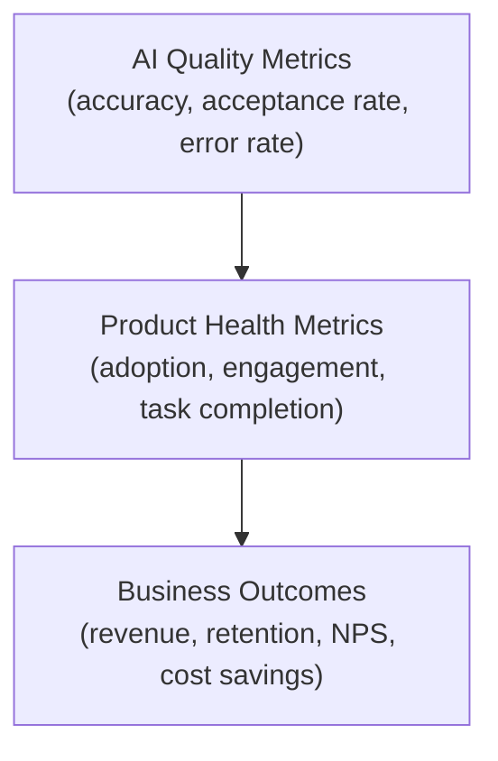
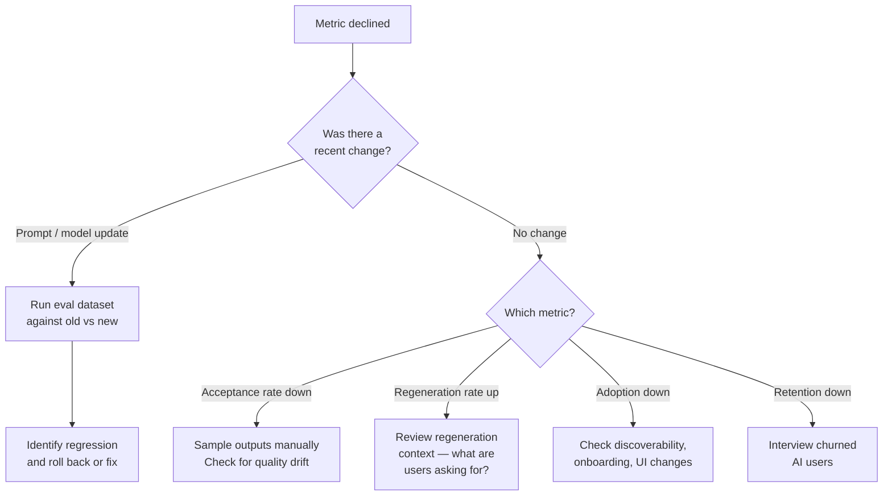

# Module 12: Measuring AI Product Success

## Why AI metrics are different

Standard product metrics — DAU, retention, conversion — tell you whether users are engaging with your product. They don't tell you whether the AI is working. A feature can have high engagement and still be causing harm through poor quality outputs that users don't notice or don't know to flag.

AI features need a second layer of measurement: quality signals that tell you whether the AI is doing its job well, not just whether users are clicking on it.

This module covers the full measurement stack for AI products: quality metrics, product health metrics, and how to connect AI performance to business outcomes.

---

## The three layers of AI product measurement



Most teams only measure the top two layers. Without the bottom layer, you can't tell whether a change in product health is caused by an AI quality change or a product design change.

---

## Layer 1: AI quality metrics

These measure how well the AI is performing its core task, independent of whether users like the product overall.

### Acceptance rate
The percentage of AI outputs that users accept without modification.

```
Acceptance rate = accepted outputs / total AI outputs shown
```

**Why it matters:** The closest proxy to "was this output good enough to use?" that you can measure at scale without human review.

**Healthy ranges:** Heavily context-dependent, but as a starting point:
- Code suggestions (Copilot-style): 25–35% acceptance is strong
- Draft emails or messages: 40–60%
- Summaries: 50–70% (users typically accept more of these)

**What to do with it:** Track over time. A declining acceptance rate before any product change signals model quality degradation. A spike after a prompt update signals improvement.

---

### Edit rate and edit distance
When users accept AI output but then edit it, how often do they edit and how much?

- **Edit rate:** % of accepted outputs that are subsequently edited
- **Edit distance:** How much the output changed (character-level diff)

**Why it matters:** High edit rate with large edit distance means the AI output is a starting point, not a solution. Low edit rate means it's close to what the user wanted. Neither is inherently bad — but knowing which is true shapes how you position the feature.

---

### Regeneration rate
The percentage of outputs where the user clicks "Regenerate" or "Try again."

```
Regeneration rate = regeneration clicks / total AI outputs shown
```

**Why it matters:** A direct signal that the first output didn't meet the user's need. Spikes indicate quality problems or prompt changes that degraded performance.

---

### Task completion rate (AI-assisted vs. baseline)
For task-oriented AI features (form filling, document drafting, customer support): what percentage of users complete the task when using AI vs. without it?

This is your north star metric for AI utility — does the AI help people get things done?

---

### Error rate and failure modes
Structured tracking of AI failures:
- Model API errors (timeout, rate limit)
- Output format failures (invalid JSON, missing required fields)
- Out-of-scope responses (AI answered something it shouldn't have)
- Safety filter triggers (content blocked)
- Empty or unusable outputs

Log these by type. Sudden spikes in any category indicate an infrastructure or prompt problem.

---

### Hallucination rate (for factual features)
The percentage of AI responses containing at least one factually incorrect claim.

This is the hardest metric to measure at scale — it requires human review or an LLM-as-judge eval pipeline. Sample 100–200 outputs per week and evaluate against ground truth.

**Leading indicators** (proxy metrics that correlate with hallucination without requiring review):
- Retrieval hit rate: did the RAG system find relevant content? Low hit rate → model is likely guessing
- User fact-check actions: if you have a "verify this" feature, track when it's used
- Thumbs down rate on factual features

---

## Layer 2: Product health metrics

Standard product metrics, interpreted through an AI lens.

### Adoption and activation

| Metric | What it tells you |
|--------|-----------------|
| AI feature activation rate | % of users who try the AI feature at least once |
| Time to first AI interaction | How quickly new users discover the feature |
| AI feature reach | % of active users who used AI in a given period |

**PM note:** Low activation often points to discoverability or onboarding, not AI quality. High activation with low retention points to quality — users tried it, found it lacking, and stopped.

---

### Retention and stickiness

- **AI feature retention:** Do users who try the AI feature come back to use it again?
- **AI-on vs. AI-off retention:** Is overall product retention higher for users who use the AI feature vs. those who don't? (Control for selection bias — power users may adopt AI features and have higher retention anyway)
- **Feature abandonment rate:** Users who started using the AI feature and then stopped

---

### Efficiency metrics (for productivity features)

- **Time saved:** Time to complete the task with AI vs. without (requires baseline measurement)
- **Output volume:** Documents created, tickets resolved, responses sent per user session — did the AI increase throughput?
- **Escalation rate:** For support AI — how often does the AI escalate to a human? Trending down means the AI is handling more; trending up means quality is declining or query complexity is increasing

---

### Satisfaction and feedback

- **In-feature ratings:** Thumbs up/down, star rating on AI outputs
- **NPS delta:** NPS for users who heavily use AI features vs. those who don't
- **Qualitative feedback:** Tag AI-related feedback separately in your support and feedback channels
- **CSAT for AI-handled interactions:** For support or assistant features, score satisfaction with AI-only resolutions separately from human-assisted ones

---

## Layer 3: Business outcomes

Connect AI quality and product health to outcomes your stakeholders care about.

| Business goal | AI metric to connect |
|---------------|---------------------|
| **Cost reduction** (support automation) | Deflection rate × cost per human ticket |
| **Revenue growth** | Conversion rate lift for AI-assisted users |
| **User retention** | Retention delta between AI users and non-AI users |
| **Productivity / efficiency** | Time saved × hourly cost × volume |
| **Quality improvement** | Error rate reduction in AI-assisted work |

**The attribution problem:** Users who adopt AI features often self-select as more engaged users. Always try to establish a causal claim, not just a correlation. Options:
- A/B test: randomly give some users access to the AI feature, measure outcomes vs. control
- Diff-in-diff: compare outcomes before/after AI adoption for the same users
- Matched cohorts: compare AI users to non-AI users with similar baseline behavior

---

## Setting up your measurement system

### What to instrument from day one

Before launch, ensure these are logged for every AI interaction:
- Session ID, user ID, timestamp
- Input length (tokens), output length (tokens)
- Model used, latency
- Whether output was accepted, edited, regenerated, or dismissed
- Thumbs up/down if in UI
- Any error codes or safety filter triggers

This is the minimum. You cannot retroactively add this data — if it's not logged from launch, it doesn't exist.

---

### Dashboards: what to review and when

**Daily (on-call / ops):**
- Error rate and failure mode spikes
- API latency and availability
- Safety filter trigger rate

**Weekly (PM review):**
- Acceptance rate, regeneration rate, edit rate — trending vs. prior week
- Thumbs down rate — any spikes or new patterns?
- Hallucination sample review (if factual feature)

**Monthly (product health):**
- Adoption and retention trends
- AI vs. non-AI user outcome comparison
- Cost per AI interaction vs. business value generated
- Eval dataset regression results (run after any prompt or model changes)

---

## Interpreting metric changes: a diagnostic flow



---

## Common measurement mistakes

| Mistake | Why it's a problem | Fix |
|---------|-------------------|-----|
| Only measuring engagement, not quality | High engagement can mask poor quality | Add AI quality metrics from day one |
| Using overall product NPS for AI features | Dilutes the signal from AI specifically | Segment NPS for AI feature users |
| Treating acceptance rate as the only quality signal | Users may accept bad output without noticing | Combine with edit distance and thumbs down |
| Not A/B testing | Can't distinguish AI effect from selection bias | Build A/B into AI feature launches |
| No baseline before AI launch | Can't prove AI improved anything | Measure the task pre-AI to establish baseline |
| Logging only successes | Failures are where the signal is | Log errors, safety triggers, regenerations |

---

## PM Decision Checklist — Module 12

- [ ] Have I defined the north star metric for this AI feature — what does "working" look like?
- [ ] Is instrumentation specced before development starts: session logs, accept/edit/regenerate events?
- [ ] Are acceptance rate, regeneration rate, and edit rate being tracked?
- [ ] For factual features: is there a hallucination sampling plan?
- [ ] Is there a dashboard plan covering daily ops, weekly PM review, and monthly health?
- [ ] Has a baseline been measured for the task pre-AI launch?
- [ ] Is there a plan to distinguish correlation from causation in AI outcome metrics (A/B test or equivalent)?
- [ ] Are AI quality metrics connected to at least one business outcome metric?
