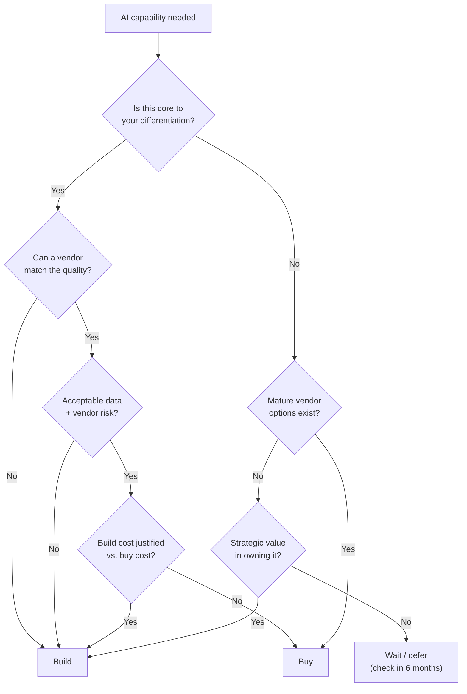

# Module 13: Build vs. Buy for AI Features

## Why this decision is different for AI

In traditional software, build vs. buy is mostly about cost and control: buy a commodity (Stripe for payments, Twilio for SMS); build what's core to your product. AI complicates this because:

- **The vendor landscape is immature.** Tools that exist today may pivot, get acquired, or shut down in 18 months.
- **The capability gap between options is large.** A hosted RAG solution and a custom-built one can produce very different quality outcomes — not just different costs.
- **The right answer shifts over time.** Something that required building 18 months ago is now a commodity API call. You need to reassess regularly.
- **AI vendors have your data.** Unlike buying a billing tool, sending your proprietary content to an AI vendor has IP and compliance implications.

---

## The decision framework

For each AI capability, evaluate it across four dimensions:

---

## Dimension 1: Is this core to your differentiation?

The most important question. If the answer is yes, defaulting to buy creates a dependency on a vendor for the thing that makes your product valuable.

**Core to differentiation — lean build:**
- The algorithm that ranks or personalizes results for your users
- The model behavior or persona that defines your product's voice
- The retrieval logic that makes your AI answers better than a competitor's
- Any AI capability where "better than X" is your primary value proposition

**Not core to differentiation — lean buy:**
- Transcription (you need audio-to-text; the quality of transcription isn't what users pay for)
- Translation (you need multilingual support; the nuance of your translation isn't the product)
- Basic document parsing (you need to extract text from PDFs; the extraction isn't the value)
- Content moderation (you need to filter harmful content; the moderation isn't the product)

---

## Dimension 2: Quality requirements

Not all vendors produce equivalent quality. Test before you decide.

**Questions to answer:**
- Does the vendor's quality meet your bar on your actual data? (Not on their benchmark — on your use case.)
- Can you tune or customize the vendor's output if quality is close but not there?
- What's the quality gap between buy and build? Is it worth the build cost to close it?

**Red flag:** Deciding to buy without running a quality evaluation on representative samples of your data. Vendor demos use cherry-picked examples. Your production data will be messier.

---

## Dimension 3: Data and vendor risk

Sending your data to an AI vendor involves trade-offs that don't exist with most SaaS tools.

**Data concerns to evaluate:**
| Concern | Questions to ask |
|---------|----------------|
| **Training data use** | Does the vendor use your data to train their models? Can you opt out? |
| **Data residency** | Where is your data processed and stored? Does this meet your compliance requirements? |
| **Data retention** | How long does the vendor retain your prompts and outputs? |
| **IP ownership** | Who owns the outputs generated using your data? |
| **Breach exposure** | If the vendor is breached, what data of yours is exposed? |

**Higher-risk data (be cautious with external vendors):**
- Customer PII
- Financial records
- Legal documents and privileged communications
- Unpublished product roadmaps or IP
- Healthcare data (HIPAA)

**Lower-risk data (vendor exposure more acceptable):**
- Publicly available content you're processing
- Anonymized data
- Internal but non-sensitive operational data

**Vendor risk beyond data:**
- Is the vendor financially stable? (Runway, funding stage)
- Do they have an enterprise contract with SLAs, not just a self-serve API?
- What's the lock-in if you need to switch? (Proprietary data format, index, or API)
- Do they have a deprecation policy?

---

## Dimension 4: Build cost vs. buy cost

This is often the dimension teams focus on first. It should be last — cost is only relevant once you've confirmed quality, differentiation, and risk are acceptable.

**True build cost includes:**
- Engineering time to build (initial + ongoing maintenance)
- Infrastructure cost (compute, storage, monitoring)
- Evaluation and testing overhead
- Keeping up with model/library updates
- On-call burden when it breaks in production

**A common mistake:** Teams estimate "2 weeks to build" and forget that maintenance, monitoring, and iteration are ongoing forever.

**True buy cost includes:**
- Vendor API fees at your expected volume
- Integration engineering time
- Migration cost if you switch vendors later
- Potential price increases (especially pre-profitability vendors)

**Rule of thumb:** If build cost is within 2× of buy cost over 2 years, prefer build for anything core. If buy cost is materially lower and it's not core, buy and re-evaluate when the market matures.

---

## The build vs. buy map by capability

Where the market currently sits (2025):

| Capability | Recommendation | Rationale |
|-----------|---------------|-----------|
| **Base LLM API** | Buy (always) | Never makes sense to train base models |
| **Embedding / vectorization** | Buy | Commodity; OpenAI, Cohere, Voyage are excellent |
| **Vector database** | Buy (with pgvector caveat) | Pinecone/Weaviate mature; pgvector if already on Postgres |
| **Transcription** | Buy | Whisper (open source) or AssemblyAI; strong quality |
| **Document parsing** | Buy | PDFplumber, Unstructured.io handle most cases |
| **Content moderation** | Buy | Perspective API, OpenAI moderation; not worth building |
| **Observability / tracing** | Buy | LangSmith, Helicone; evolving but functional |
| **Retrieval logic + ranking** | Build | This is close to core for most AI products |
| **Prompt engineering / system prompts** | Build | Always — this is your product behavior |
| **Evaluation criteria + datasets** | Build | Your quality bar is specific to your use case |
| **Fine-tuning** | Situation-dependent | See below |
| **Agent orchestration** | Situation-dependent | See below |

---

## Two nuanced cases

### Fine-tuning: build or buy?

Fine-tuning involves updating a base model's weights on your data to specialize its behavior.

**Buy (use a hosted fine-tuning service):** When you need a specific output style or format and prompting alone doesn't achieve it, but the training data is not highly sensitive and the volume doesn't justify in-house ML infrastructure.

**Build (run fine-tuning yourself):** When your training data is sensitive and can't leave your infrastructure; when you're operating at a scale where hosting costs justify owning the pipeline; when you need full control over the training process for compliance reasons.

**Skip entirely:** Most of the time. Exhaust prompt engineering and RAG before considering fine-tuning. Most teams that think they need fine-tuning actually need better prompts.

---

### Agent orchestration: build or buy?

Frameworks like LangChain and LlamaIndex provide pre-built orchestration — tool routing, retry logic, memory management.

**Buy (use a framework):** For simpler agents with standard patterns (RAG, sequential chains). Gets you to a working prototype faster.

**Build (custom orchestration):** When your agent flow has enough specific logic that the framework adds more complexity than it saves; when you need fine-grained control over retry behavior, error handling, or cost optimization; when debugging is a priority (frameworks can obscure what's actually happening).

**The practical answer:** Start with a framework, migrate to custom code when the framework becomes the bottleneck. Most mature teams end up with light custom orchestration.

---

## The "wait" option

Not every AI capability needs to be solved now. Some things currently require significant build effort that will become a commodity API call within 12 months.

**Signs a capability is about to commoditize:**
- Multiple vendors are racing to offer it
- Open-source solutions are approaching production quality
- Foundation model providers have announced it on their roadmap

**When to wait:**
- The capability isn't on the critical path for your current roadmap
- The current quality bar from vendors is close but not there
- Your engineering resources are better spent on differentiated work

Deferring is an underused option. "Buy in 6 months when the market matures" is often the right answer.

---

## Reassessment cadence

The build vs. buy landscape for AI changes faster than almost any other technology category. Set a regular review:

- **Quarterly:** Is anything we built now available as a better/cheaper vendor option?
- **Quarterly:** Is any vendor we rely on showing stability risk (funding, terms changes, quality degradation)?
- **Annually:** Full audit of the AI stack — what can be simplified, what should move in-house, what new options exist?

---

## PM Decision Checklist — Module 13

- [ ] For each AI capability: have I evaluated all four dimensions (differentiation, quality, data risk, cost)?
- [ ] Have I run a quality evaluation on our actual data — not vendor benchmark claims?
- [ ] Have I reviewed the vendor's data use policy, training opt-out, and retention policy?
- [ ] Does our data classification make any capabilities too sensitive to send to external vendors?
- [ ] Have I calculated true build cost including maintenance, not just initial development?
- [ ] Have I calculated true buy cost including projected volume-based fees at scale?
- [ ] Is fine-tuning being proposed? If so: have we exhausted prompt engineering and RAG first?
- [ ] Have I identified any capabilities where "wait 6 months" is the best answer?
- [ ] Is there a scheduled reassessment date for this decision?
