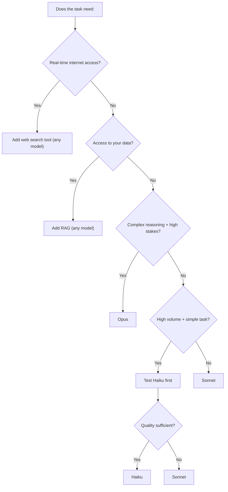

# Module 14: Cost, Latency & Model Selection

## Why this matters for product decisions

AI API costs are input-driven and can surprise you. A feature that costs $0.001 per user request looks cheap — until you have 100,000 daily users, 10 requests each. That's $1,000/day. Equally, a latency-insensitive background job doesn't need the same model as a real-time chat feature.

Cost and latency are design inputs, not engineering afterthoughts. You should be able to estimate them before a feature goes to development.

---

## How LLM pricing works

APIs charge per **million tokens** (input and output priced separately). Output tokens cost more than input tokens — generating text is more expensive than reading it.

**Claude pricing reference (approximate, 2025):**
| Model | Input per 1M tokens | Output per 1M tokens |
|-------|--------------------|--------------------|
| Claude Haiku 4.5 | ~$0.80 | ~$4 |
| Claude Sonnet 4.6 | ~$3 | ~$15 |
| Claude Opus 4.7 | ~$15 | ~$75 |

Check [anthropic.com/pricing](https://www.anthropic.com/pricing) for current rates — these change.

**Cost estimation formula:**
```
Cost per request = (input tokens × input price) + (output tokens × output price)
Daily cost = cost per request × requests per day
```

**Example — a summarization feature:**
- System prompt: 200 tokens
- User document: 3,000 tokens
- Output summary: 400 tokens
- Total: 3,200 input + 400 output = 3,200 × $3/1M + 400 × $15/1M
- = $0.0096 + $0.006 = **~$0.016 per request** on Sonnet

At 1,000 requests/day = $16/day = ~$480/month. Manageable. At 100,000 requests/day = $1,600/day. Worth designing around.

---

## The three cost levers

### Lever 1: Model tier
The most impactful lever. Switching from Opus to Sonnet can cut cost 5×. Switching from Sonnet to Haiku can cut it another 4×.

**The selection process:**
1. Prototype with Sonnet (it's the balanced default)
2. If cost is a problem, test Haiku — does quality hold for this specific task?
3. Only use Opus if Sonnet demonstrably fails at the task (nuanced judgment, complex reasoning)
4. Never use Opus for high-volume, simple tasks (classification, extraction, summarization)

---

### Lever 2: Prompt caching
When the same content is at the start of many prompts (system prompt, large documents, FAQ content), caching lets the API store it and avoid re-processing it each time.

**Example:** A customer support bot with a 5,000-token system prompt + knowledge base.
- Without caching: pay 5,000 input tokens on every request
- With caching: pay once to write the cache, then ~10% of the input token cost to read from it

Claude supports prompt caching natively. It's one of the highest-leverage cost optimizations and should be default for any feature with a large, stable system prompt.

---

### Lever 3: Output length control
Output tokens cost 5× more than input tokens on Sonnet. Controlling output length is a direct cost control.

Add explicit length constraints to your system prompt:
- "Respond in under 100 words."
- "Return only the JSON object, no explanation."
- "Summarize in exactly three bullet points."

Without constraints, models tend to over-explain. A model asked to summarize will often produce 3× more output than needed.

---

## Latency: what determines response time

| Factor | Impact on latency |
|--------|------------------|
| Model tier | Opus is 2–3× slower than Sonnet; Haiku is fastest |
| Output length | Longer outputs take longer (generation is sequential) |
| Context size | Very large contexts add processing time |
| Streaming | First token appears quickly; user perceives lower latency |
| Parallel calls | Multiple calls can run simultaneously |
| Network | API roundtrip adds 100–300ms |

**Typical latency ranges (Sonnet, 2025):**
- Short response (<100 tokens): 1–3 seconds
- Medium response (100–500 tokens): 3–8 seconds
- Long response (500–2,000 tokens): 8–25 seconds

Latency matters differently based on context:
- **Interactive/synchronous** (user waiting): 3 seconds feels fast, 10 seconds feels slow, 30 seconds is unacceptable
- **Background/async** (processing happens while user does something else): 60 seconds is fine
- **Batch processing** (no user waiting): minutes are acceptable

---

## Streaming: the latency perception trick

Streaming returns tokens to the user as they're generated, rather than waiting for the complete response.

Without streaming: user waits 8 seconds, then sees the full response appear.  
With streaming: user sees the first word in ~0.5 seconds, then watches it "type out."

The total time is the same. The perceived responsiveness is completely different. For any user-facing chat or generation feature, always stream.

**Implementation note:** Streaming changes how you handle errors and output parsing. The model is mid-response when something goes wrong. Spec how partial responses are shown (or not) to users.

---

## Batching: for non-real-time workloads

If you're processing documents, running analysis, or generating content in bulk, use the Batch API instead of real-time calls:
- 50% cost reduction
- Higher throughput
- Accepts up to 24 hours turnaround

Use cases:
- Nightly analysis of the day's support tickets
- Batch document summarization
- Generating product descriptions for a catalog
- Running evals

Never use real-time calls for batch workloads. It's twice the cost for the same result.

---

## The model selection decision tree



---

## Estimating costs before building: a worked example

**Feature:** AI-powered meeting notes summarizer
- Input: meeting transcript (~4,000 tokens)
- System prompt: ~300 tokens
- Output: structured summary (~600 tokens)
- Model: Sonnet

**Cost per summary:**
- Input: 4,300 tokens × $3/1M = $0.013
- Output: 600 tokens × $15/1M = $0.009
- Total: ~$0.022 per summary

**Volume estimate:** 500 meetings/day

**Daily cost:** 500 × $0.022 = **$11/day (~$330/month)**

Now consider with prompt caching (the 300-token system prompt is stable):
- Cached read cost ≈ 10% of input price
- Savings: 300 tokens × $3/1M × 90% discount = ~$0.001 per request
- Not significant here (small system prompt)

Compare: if the system prompt were 5,000 tokens (large knowledge base):
- Without caching: 5,000 × $3/1M = $0.015 per request
- With caching: $0.0015 per request
- At 500/day: saves $6.75/day = ~$2,500/year. Worth implementing.

---

## PM Decision Checklist — Module 14

- [ ] Have I estimated cost per request and daily cost at expected volume?
- [ ] Is the model tier justified? Have I tested a cheaper tier?
- [ ] Is there a large stable system prompt? If yes, is prompt caching implemented?
- [ ] Are output length constraints in the prompt to prevent over-generation?
- [ ] Is the feature user-facing (streaming required) or background (async/batch acceptable)?
- [ ] For batch workloads: are we using the Batch API, not real-time calls?
- [ ] What's the latency budget for this feature? Is the model tier and output length consistent with that budget?
- [ ] At what volume does this feature become too expensive? Is there a plan for that?
