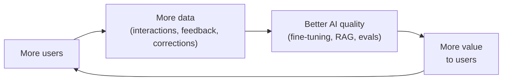
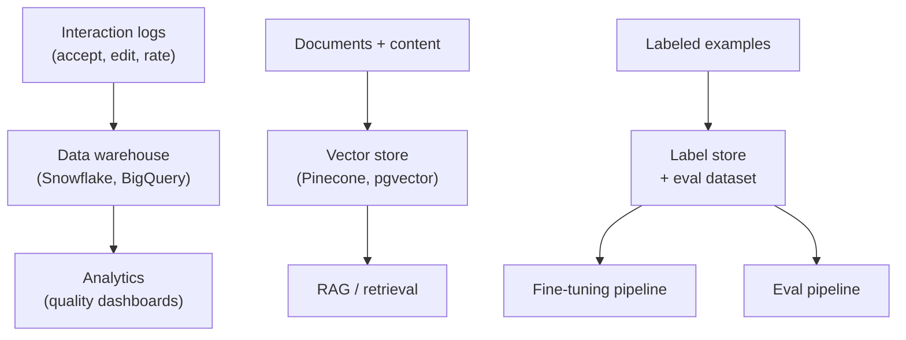

# Module 14: Data Strategy for AI Products

## Why data strategy is different for AI

In traditional software, data is what your product stores and displays. In AI products, data is what makes your product work — and potentially what makes it defensible.

The model is a commodity. Your data is not. Two products can use the same foundation model and produce dramatically different quality and value, purely because of differences in what data they have and how they use it.

This module covers the PM-level data strategy decisions that determine whether your AI product gets better over time, or stays flat.

---

## The data flywheel

The most valuable AI products are built on a data flywheel: a self-reinforcing cycle where more users generate more data, which improves the AI, which attracts more users.

The flywheel only spins if you're deliberately capturing, labeling, and using the data your product generates. Many products have the usage but miss the flywheel because they're not closing the loop.

---

## Types of data that improve AI products

### 1. Interaction data
What users do with AI outputs: accept, edit, regenerate, dismiss, rate.

This is your highest-volume, lowest-cost signal. You're already generating it — you just need to log it and use it.

**How to use it:**
- Identify which types of requests have low acceptance rates → improve prompts for those cases
- Collect edited outputs as training examples (user's edit = preferred output)
- Use regeneration patterns to find failure modes
- Track thumbs down to build a queue for human review

---

### 2. Labeled examples
Human-reviewed examples of good and bad AI outputs, tagged with quality dimensions.

This is more expensive (requires human time) but higher signal. Used for:
- Fine-tuning (training the model on what "good" looks like in your domain)
- Eval datasets (automated quality testing)
- LLM-as-judge calibration (training the evaluator)

**Building a labeling pipeline:**
- Define a clear rubric before labeling starts (Module 16)
- Start with failures — label outputs that users flagged as bad; these are highest value
- Use internal domain experts, not generic crowd-labelers, for specialized content
- Establish inter-annotator agreement early — if two labelers disagree, the rubric needs work

---

### 3. Domain-specific content
The documents, data, and knowledge specific to your domain that a general model doesn't have.

**Examples:**
- A legal AI trained on your firm's past case outcomes and internal memos
- A support AI with access to your full product documentation and resolved ticket history
- A sales AI with access to your CRM, past deals, and win/loss notes
- A medical AI with access to clinical guidelines, formularies, and treatment protocols

This is your RAG index (Module 7). The quality of what you index directly determines the quality of AI answers. Treat it as a product, not a technical artifact.

---

### 4. Behavioral signals
Downstream outcomes that tell you whether the AI produced value, not just whether the output seemed good.

**Examples:**
- Did the AI-drafted email get a reply? (better than "did the user accept the draft?")
- Did the customer who interacted with the support AI resolve their issue without calling back?
- Did the developer who accepted the code suggestion submit that code, or revert it later?
- Did the document the AI summarized actually get acted on?

Behavioral signals are harder to collect but represent the ultimate ground truth on AI value. Build tracking for them early — they're almost impossible to add retroactively.

---

## Data moats: where defensibility comes from

A data moat exists when your proprietary data makes your AI meaningfully better in ways a competitor can't easily replicate.

**Strong moats:**
- **Network effects + data:** Each user's activity improves the model for all users (e.g., Duolingo's learner data improving language models)
- **Proprietary labeled datasets:** Thousands of human-labeled examples in a specialized domain
- **Longitudinal user data:** Years of user history that enables genuine personalization
- **Exclusive data access:** Partnerships or agreements giving you data no competitor can get

**Weak moats:**
- "We have more data" without quality or specificity — a competitor with better-curated smaller data often wins
- Public data you've indexed — anyone else can index the same sources
- General internet data — the foundation models already trained on this

**PM implication:** Identify where data accumulates uniquely in your product. That's where to invest in data infrastructure. Not all data is equal — 1,000 high-quality labeled examples in your domain often beats 100,000 generic interactions.

---

## Data quality over data quantity

A common mistake is optimizing for volume when quality matters more.

**Signs of a data quality problem:**
- High volume of interaction data, but acceptance rates aren't improving
- Eval scores improving on the labeled dataset but production quality isn't moving
- Fine-tuning makes some outputs better but introduces new failure modes

**Data quality dimensions:**

| Dimension | What it means | How to check |
|-----------|--------------|-------------|
| **Accuracy** | Does the data reflect ground truth? | Human audit of a random sample |
| **Consistency** | Would different labelers agree? | Inter-annotator agreement score |
| **Coverage** | Does the data represent the full range of use cases? | Distribution analysis by query type |
| **Freshness** | Is the data current? | Timestamp distribution; watch for concept drift |
| **Bias** | Is any group or topic over/under-represented? | Demographic and topic distribution analysis |

---

## Data infrastructure for AI products

The infrastructure you need depends on which data types you're using and at what scale. As a PM, you need to know what you're asking engineering to build.

**What to ask for upfront:**
- Interaction logging before launch (you can't go back)
- A data warehouse or at minimum structured logs for AI interactions
- A labeling tool or process (even a spreadsheet to start)
- An eval dataset store that lives in version control alongside the prompt

---

## Data governance for AI

Data governance decisions made early prevent expensive problems later.

### What data can be used for training?
Check your terms of service, privacy policy, and any enterprise agreements. Users may not have consented to their data being used to train models. This is especially important if you're fine-tuning on user-generated content.

**Rule:** Default to not using user data for training without explicit consent. Offer opt-in, not opt-out, for anything beyond operational improvement.

---

### Data retention and deletion
AI interaction logs can accumulate fast. Define:
- How long are interaction logs retained?
- Can users request deletion of their AI interaction history?
- If a user requests account deletion, are their interactions removed from training data?

---

### Synthetic data
When you don't have enough real labeled data, synthetic data — AI-generated examples — can bootstrap training and eval datasets.

**When it works:**
- Generating diverse variations of a small set of real examples
- Creating adversarial test cases for safety evaluation
- Filling coverage gaps in an eval dataset

**When it doesn't:**
- As a substitute for real user data in fine-tuning (models trained on synthetic data often overfit to the synthetic distribution)
- When the domain requires real-world nuance that the generator doesn't have

---

## The data roadmap: questions to answer for any AI product

**Now (before launch):**
- What interaction events are we logging from day one?
- What is our eval dataset built from, and how will it grow?
- What data do we have access to for RAG, and who maintains it?

**Short term (first 3 months):**
- Are acceptance/edit/regeneration patterns telling us anything about prompt improvements?
- Are we accumulating labeled examples from production failures?
- Is our RAG index fresh and accurate?

**Medium term (6–12 months):**
- Is there enough labeled data to consider fine-tuning?
- Where is the data flywheel spinning? Where is it not?
- What proprietary data do we have that a new entrant couldn't replicate?

**Long term (12+ months):**
- What is our data moat? Can we articulate it specifically?
- Are we investing in exclusive data sources or partnerships?
- Is our data quality improving or degrading as volume grows?

---

## PM Decision Checklist — Module 14

- [ ] What interaction events are we logging, and is this specced before development starts?
- [ ] Do we have a plan for building a labeled dataset from production outputs?
- [ ] What domain-specific content feeds our RAG index, and who owns keeping it fresh?
- [ ] Have we identified where proprietary data accumulates in our product — that's our moat?
- [ ] Is data quality (accuracy, consistency, coverage) being tracked alongside volume?
- [ ] Have we reviewed terms of service and privacy policy for consent to use data in training?
- [ ] Is there a data retention and deletion policy for AI interaction logs?
- [ ] Have we identified the behavioral signals (downstream outcomes) that represent true AI value?
- [ ] Is there a data roadmap with milestones at 3, 6, and 12 months post-launch?
