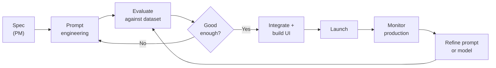

# Module 15: Working with AI Engineering Teams

## What's different about AI engineering

AI engineering has different rhythms, failure modes, and uncertainty profiles than traditional software engineering. A feature that seems simple can take 3× longer than estimated because the model behaves unexpectedly. A feature that seems complex might work on the first prompt draft. Traditional estimation and planning assumptions break down.

As a PM, adapting how you write specs, run planning, interpret results, and make decisions is what separates smooth AI feature delivery from constant frustration on both sides.

---

## The AI engineering workflow

Understanding the loop your engineers are in helps you know where you fit.

The inner loop (prompt → eval → refine) can run many times before the feature is ready to integrate. The outer loop (monitor → refine) runs continuously after launch.

**PM implication:** Your job is to make the evaluation criteria clear and stable. If the definition of "good enough" keeps changing, the inner loop never terminates.

---

## Writing specs AI engineers can build from

The single biggest thing you can do to accelerate AI development is write a spec that reduces ambiguity in the evaluation criteria. An underspecified AI spec generates wasted iteration cycles.

### What a good AI feature spec contains

**1. The task, precisely described**
Not "summarize documents" but "given a support ticket thread (2–20 messages), produce a 3-sentence summary covering: the user's core issue, what was tried, and the current resolution status."

**2. Input specification**
- What is the input? What forms can it take?
- What are the edge cases in the input? (empty, very long, multiple languages, structured vs. unstructured)
- What preprocessing is expected?

**3. Output specification**
- Exact format (prose, JSON with schema, structured template)
- Length constraints
- Example of a good output
- Example of a bad output (often more useful than a good example)

**4. Quality criteria**
- What dimensions matter? (accuracy, tone, completeness, conciseness)
- How will you measure each dimension?
- What's the minimum bar for each? ("completeness must cover the core issue; missing resolution status is acceptable if not available")

**5. Explicit failure handling**
- What should happen when the input doesn't have enough information?
- What should happen when the input is in an unexpected format?
- What should the model say vs. not say when it's uncertain?

**6. Constraints and out-of-scope**
- What must the model never do?
- What topics or actions are out of scope?
- What regulatory or safety constraints apply?

---

## How to estimate AI work

AI features are harder to estimate than traditional features. Use these adjustments:

### The three-phase estimation model

| Phase | What it covers | Typical duration |
|-------|---------------|-----------------|
| **Spike / prototype** | Can the model do this task at all? What's the rough quality bar? | 1–3 days |
| **Iteration** | Bring quality to launch bar through prompt engineering + eval | 1–4 weeks (highly variable) |
| **Integration** | Build the UI, connect data sources, productionize | Estimate as normal software |

Never skip the spike. Committing to a launch date before a spike is completed means you're estimating without knowing if the core capability works.

### Red flags in AI estimates
- "We'll figure out the prompts during integration" — prompts need their own iteration time
- No eval dataset defined — you can't know when you're done without a quality bar
- "The model is really good at this" — based on demos, not tested on your actual data
- Timeline set before a spike — you don't know if the approach works yet

---

## Reading AI engineering output

You'll regularly review pull requests, eval results, and demo outputs that involve model behavior. Here's what to look for.

### In a system prompt (PR review)

Ask:
- Is the role clearly defined?
- Are the output format and length constraints specified?
- Are there examples of good outputs?
- Is there an instruction for what to do when the model doesn't know?
- Is there a rule preventing prompt injection?
- Is this the simplest prompt that could work, or has complexity accumulated?

**Watch for:** Overly long system prompts that have grown through iteration without pruning. Long prompts can mask earlier instructions. Ask: "Can we test removing this section and see if quality holds?"

---

### In an eval result

What engineers typically share: a score (e.g., "83% acceptance rate on eval set") and optionally the failing cases.

**Ask:**
- What's in the eval dataset — is it representative of production traffic?
- What are the failure cases? What patterns do they share?
- Is the score on the full dataset or a filtered subset?
- Has this been compared against the baseline (previous prompt, different model)?
- What's the confidence interval? (a small eval set can show large variance)

**Watch for:** Eval scores improving while the failure cases look worse. This can happen when a prompt change fixes common cases but makes rare-but-important cases worse. Always look at the failing examples, not just the aggregate score.

---

### In a model output demo

When an engineer shows you the feature working:
- Ask to see failure cases, not just the happy path
- Try edge case inputs yourself
- Ask: "What input made it fail most recently?"
- Ask: "Is this the same prompt that will go to production, or a polished version?"

---

## The questions to ask in sprint planning

When an AI feature lands in the sprint:

**Before committing:**
- Has a spike been done? What did we learn?
- What's the eval dataset and what's the quality bar for launch?
- How many prompt iteration cycles are in the estimate?
- What data sources does this need access to, and are they ready?

**During sprint:**
- What does the eval score look like this week vs. last week?
- What are the current top failure modes?
- Are we stuck on a specific failure pattern? (This is where spikes can turn into sinkholes)

**At sprint review:**
- Run edge case inputs live, not just the happy path demo
- Ask about the adversarial test results
- Confirm the eval dataset was run against the build, not just eyeballed

---

## Managing model and prompt changes post-launch

After launch, both the model and the prompt will change. These changes carry risk.

### Model version changes
Foundation model providers release new versions and deprecate old ones. A new model version can change output behavior even with the same prompt — sometimes better, sometimes worse, sometimes just different.

**Process for model updates:**
1. Run the full eval dataset against the new model version before switching
2. Compare outputs on a representative sample — not just scores but actual text
3. Check edge cases and adversarial inputs specifically
4. Stage the rollout (10% traffic first) with quality monitoring before full switch
5. Keep the previous version on standby for at least two weeks after switching

**Never switch model versions without running evals first. This is a breaking change.**

---

### Prompt changes
System prompt changes are code changes. They should be:
- Version-controlled (in git, not a database field only the PM can edit)
- Reviewed before merging
- Tested against the eval dataset before deploying
- Deployed with the ability to roll back

**The anti-pattern to avoid:** A shared prompt in a CMS or database that anyone can edit without a review or test process. This is one of the fastest ways to silently break an AI feature in production.

---

## Communicating AI uncertainty to stakeholders

AI development has genuine uncertainty that's hard to explain to stakeholders used to traditional feature delivery. The framing that helps:

**Instead of:** "We're building an AI feature that will do X by [date]."

**Use:** "We're running a spike to validate feasibility by [date], then we'll estimate iteration time based on what we learn. We expect to launch by [range] depending on what the spike shows."

**For quality commitments:**
- Define quality as a measurable bar ("85% acceptance rate on our eval set") not a subjective claim ("it works well")
- Show stakeholders the eval dataset and what the scores mean in real terms
- Be explicit that quality will continue to improve post-launch, not be perfect at launch

**For unexpected failures in production:**
- Frame them as "we found a new failure pattern" not "the feature is broken"
- Have a rollback plan (previous prompt version, fallback UI) so failures can be contained quickly
- Add the failure case to the eval dataset — production failures are the most valuable eval examples

---

## The PM–AI engineer working contract

Align on these explicitly at the start of any AI feature:

| Topic | What to agree on |
|-------|-----------------|
| **Eval dataset ownership** | Who builds it? Who reviews and approves it? |
| **Quality bar for launch** | Specific score on specific metrics — not "good enough" |
| **Prompt ownership** | Who can change the prompt? What's the change process? |
| **Model change process** | How much notice before a model version change? What's the eval gate? |
| **Production monitoring** | Who watches the quality metrics? What triggers an incident? |
| **Iteration budget** | How many prompt iterations are in scope before we reconsider the approach? |

---

## PM Decision Checklist — Module 15

- [ ] Is the task description precise enough that two engineers would build the same thing?
- [ ] Is the output format and quality criteria spec'd before development starts?
- [ ] Has a spike been completed before committing to a launch date?
- [ ] Is the eval dataset defined and owned before the iteration phase starts?
- [ ] Are system prompts in version control with a review process?
- [ ] Is there a defined process for model version changes (eval gate + staged rollout)?
- [ ] Have I aligned with the engineering team on the PM–engineer working contract above?
- [ ] Am I communicating uncertainty to stakeholders in terms of measurable quality bars, not vague claims?
- [ ] Is there a production monitoring plan with named owners and alerting thresholds?
