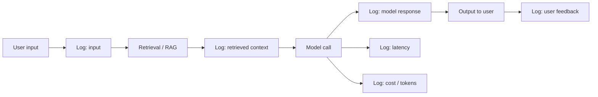
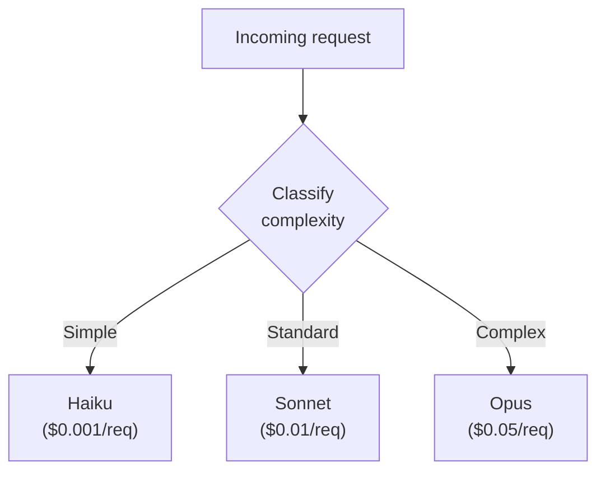
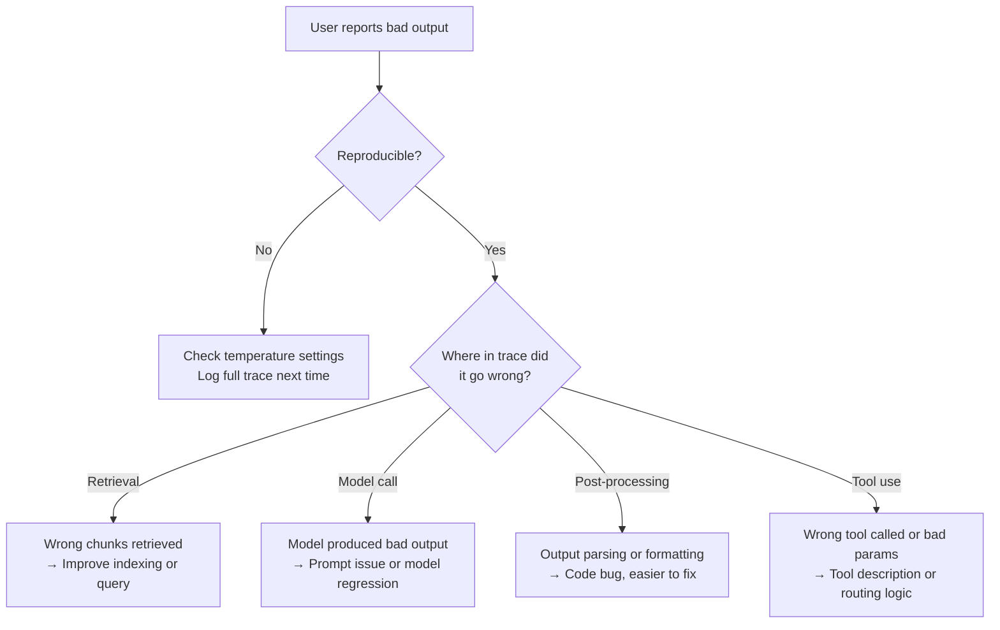

# Module 18: Observability & Monitoring

## Why observability is different for AI products

In traditional software, observability means knowing whether your servers are up and your APIs are responding. Errors are deterministic — when something fails, you get a stack trace and you fix it.

In AI products, observability means something more: you need to know whether the AI is *behaving correctly*, not just whether the system is up. A request can succeed (200 OK, low latency, no errors) and still produce a hallucinated answer that misleads the user. A request can fail in subtle ways the model never raises (silently returning truncated output, hitting safety filters, retrieving the wrong context). Without specific instrumentation, these failures are invisible.

This module is about the operational instrumentation that lets you know what your AI is actually doing — distinct from Module 17's product metrics, which are about user-facing quality outcomes. Both layers matter; this one is the engineering and ops layer.

---

## What to log: the six things you need

For every AI interaction, log these. If any are missing, you'll find yourself debugging blind in production.



| What to log | Why it matters |
|------------|----------------|
| **Input** | The exact user request — needed to reproduce any issue |
| **Retrieved context** | What documents/data the system pulled — most RAG failures are retrieval failures, not model failures |
| **Model response** | The raw model output before any post-processing |
| **Latency** | End-to-end time and time-per-component (retrieval, model, post-processing) |
| **Cost / tokens** | Input + output tokens, model used, dollars spent |
| **User feedback** | Thumbs up/down, edits, regenerations — connects technical events to quality signals |

This isn't optional. If you can't see all six, you can't operate the product.

---

## Trace-based observability

For multi-step AI systems (RAG, agents, multi-agent), single events aren't enough. You need to trace a full request across all its components.

A trace shows the complete lifecycle of one user request:

```
[Trace ID: abc-123]
├─ User input received (0ms)
├─ Embedding query (45ms, $0.0001)
├─ Vector search (120ms)
├─ Top-5 chunks retrieved
├─ Prompt assembled (5ms, 4,200 input tokens)
├─ Model call (3,400ms, $0.013, Sonnet)
├─ Output post-processing (10ms)
└─ Response delivered to user (3,580ms total, $0.0131)
```

This is the level of detail you need to debug "why was this response slow?" or "why did this answer ignore the obvious source document?"

**Tooling options:**

| Tool | Strength |
|------|---------|
| LangSmith | Tightly integrated with LangChain; rich trace UI |
| Helicone | Drop-in proxy; works with any LLM provider |
| Arize / Phoenix | Production ML observability; strong on quality drift |
| OpenTelemetry + custom | Most flexible; integrates with existing observability stack |
| Provider built-in | Anthropic and OpenAI both offer basic tracing dashboards |

For early-stage products, the provider's built-in dashboards plus structured logs are usually enough. Add a dedicated tool when traces become hard to navigate manually.

---

## Production metrics: what to monitor and alert on

Different metrics serve different operational purposes.

### Real-time / on-call metrics
Watched continuously, alerted on thresholds.

| Metric | Healthy range | What a spike means |
|--------|--------------|-------------------|
| **API error rate** | <1% | Provider issue or auth/rate limit problem |
| **P95 latency** | Within budget | Provider degradation, retrieval slowdown, prompt size growth |
| **Safety filter trigger rate** | Stable baseline | Adversarial usage spike or new failure pattern |
| **Cost per hour** | Within forecast | Bug, abuse, or runaway agent loop |
| **Empty / null response rate** | <0.5% | Model returning nothing — usually prompt or content filter issue |

### Daily ops review
Reviewed every morning by whoever's on AI ops duty.

| Metric | What to look for |
|--------|-----------------|
| Daily request volume | Matches expected pattern? |
| Error breakdown by type | Any new error patterns? |
| Top 10 slowest requests | What made them slow — can we fix? |
| Top 10 most expensive requests | Cost outliers, especially in agentic features |
| Out-of-scope rate | Users trying things the AI can't do |

### Weekly PM review
Connects technical signals to product quality.

| Metric | Connects to |
|--------|------------|
| Acceptance rate vs. last week | Module 17 — overall quality direction |
| Regeneration rate trends | User satisfaction with first outputs |
| Retrieval hit rate | RAG quality — is the index serving the right content? |
| Cost per successful interaction | Unit economics of the feature |

### Monthly health review
Strategic view of the AI system's health.

- Cost growth vs. revenue/value generated
- Quality metrics vs. baseline at launch (regression check)
- New failure modes added to eval dataset
- Model and prompt version changes and their impact

---

## Cost monitoring and model routing optimisation

Cost is a first-class observability signal — not just a finance concern.

### What to track

- **Cost per request** (broken down by feature, model, user segment)
- **Cost per successful outcome** (successful requests only)
- **Token efficiency** (output tokens / input tokens — high ratios may signal verbose models)
- **Cache hit rate** (for prompt caching — low rates mean you're paying for repeated context)
- **Distribution of model usage** (% Haiku / % Sonnet / % Opus — drift up the tier ladder is expensive)

### Model routing as an optimisation lever

Once you have cost data, model routing — sending different requests to different models based on complexity — becomes a real optimisation. Patterns:



Routing logic can be:
- Rule-based (input length, user tier, feature flag)
- Classifier-based (a fast Haiku call decides which model handles the request)
- Confidence-based (try Haiku first; if confidence is low, escalate to Sonnet)

**PM consideration:** Routing creates complexity. Don't introduce it until cost is actually a problem and the volume justifies the engineering work. A rule of thumb: routing is worth building when AI costs exceed ~$5,000/month.

---

## Debugging AI failures: from symptom to root cause

When something goes wrong in production, the diagnostic flow is different from traditional software:



The biggest mistake in AI debugging: assuming the model was wrong. Most AI failures are *retrieval* failures or *prompt* issues, not the model getting the answer wrong. Trace the full request before blaming the model.

---

## Quality drift detection

Unlike traditional software where behaviour is stable until someone changes it, AI behaviour can drift even when nothing in your system changes. Causes:

- **Model version updates** (the provider quietly improves the model — sometimes worse for your use case)
- **Data drift** (your RAG index content changes; new types of user queries emerge)
- **Prompt drift** (engineers make small "improvements" that accidentally regress quality)

**Drift detection tactics:**

1. **Run the eval dataset weekly** against the production system. Score regressions immediately.
2. **Track acceptance/regeneration trends.** Persistent decline = drift.
3. **Sample 50–100 outputs weekly** for human review. Spot-check for quality.
4. **Track output length distribution.** If average output suddenly grows or shrinks, something changed.
5. **Subscribe to model deprecation notices.** Don't be surprised by a forced model upgrade.

---

## The instrumentation gate

Before any AI feature ships to production, verify:

- [ ] All six log fields are captured (input, retrieved context, response, latency, cost, feedback)
- [ ] Traces are stitched together by a request ID across all components
- [ ] Real-time alerts are configured for error rate, latency, cost spikes, safety filter rates
- [ ] Daily/weekly/monthly dashboards exist with the right metrics for each cadence
- [ ] At least one engineer knows how to look up "what happened on this specific request" within 2 minutes
- [ ] Eval dataset can be re-run against production prompts on demand

Missing any of these = not ready for production.

---

## PM Decision Checklist — Module 18

- [ ] Are all six log fields captured for every AI interaction?
- [ ] Can we trace any individual request across retrieval, model, and post-processing?
- [ ] Are real-time alerts configured for error rate, latency, cost, and safety filter spikes?
- [ ] Is there a daily ops review with named owner and clear runbook?
- [ ] Is there a weekly review connecting technical signals to product quality (Module 17)?
- [ ] Is cost broken down by feature and model tier?
- [ ] Is there a process for detecting quality drift (eval re-runs, sampling, distribution monitoring)?
- [ ] When a failure is reported, can we get from symptom to root cause via the trace, not by guessing?
