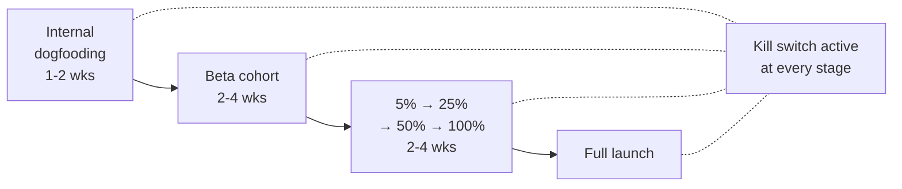
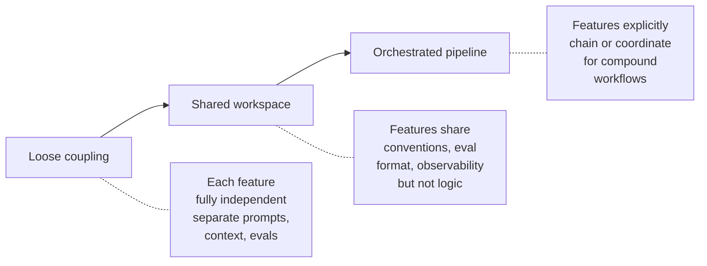

# Module 20: Production Readiness & Operations

## What "production-ready" means for AI

A traditional feature is production-ready when it works, has tests, and can be deployed safely. AI features need a higher bar. They can pass functional tests and still:

- Hallucinate confidently in ways that embarrass the company
- Degrade silently as the model, data, or domain changes
- Cost more in production than they generate in value
- Fail in novel ways no one anticipated

Production readiness for AI means having the right quality bar, the right rollout strategy, the right kill switch, and an explicit plan for the ongoing maintenance the feature will need *forever* — not just at launch.

This module covers what changes about going to production and staying there.

---

## The go/no-go quality bar

Before any AI feature ships, define a specific, measurable quality bar. Vague claims like "it works well" are a launch failure waiting to happen.

**A real quality bar has four properties:**

1. **Specific metric** — Acceptance rate, accuracy, task completion, etc.
2. **Numerical threshold** — Not "high acceptance" but "≥75% acceptance on the eval dataset"
3. **On a defined dataset** — Eval dataset (Module 17), not vibes
4. **Safety override** — No critical safety findings unresolved, regardless of quality score

```
Launch criteria for [feature name]:
- Acceptance rate ≥ 75% on representative eval set (n=50)
- Hallucination rate ≤ 3% on factual sample (n=100)
- P95 latency ≤ 4 seconds for interactive use
- Cost per request ≤ $0.025 at expected volume
- Zero unresolved critical findings from red-team
- Rollback plan documented and tested
```

**Failure to launch:** If any criterion isn't met, the feature doesn't ship — even if the date slips. The cost of launching a broken AI feature (reputation, trust, support load, incident response) far exceeds the cost of delay.

---

## Rollout strategy: power users → gradual → all

Don't ship AI features to 100% of users on day one. Stage the rollout to surface problems at small scale before they affect everyone.

### Stage 1: Internal dogfooding (1–2 weeks)
The team building it uses it daily. Catches the obvious bugs and embarrassments.

### Stage 2: Power users / beta cohort (2–4 weeks)
Invite-only or feature-flagged for engaged users who can tolerate rough edges and provide quality feedback.

**Goals:**
- Validate quality at real-world scale (10–100× internal volume)
- Find failure modes that didn't appear in eval
- Refine UX based on real usage patterns

### Stage 3: Gradual percentage rollout (2–4 weeks)
Move from 5% → 25% → 50% → 100% of users with quality monitoring at each step.

**Move forward only if:**
- Acceptance rate holds at higher volume
- No new critical failure modes
- Cost remains within budget
- Support ticket volume is manageable

### Stage 4: Full rollout
Feature is generally available. Monitoring continues; eval dataset still runs on every prompt change.



---

## The kill switch: not optional

Every AI feature needs a kill switch — a fast way to disable it in production without a code deploy. This is not optional, and it must be tested before launch.

**What a kill switch does:**
- Disables the AI feature for all users immediately
- Falls back to a defined non-AI experience (or a graceful "unavailable" message)
- Stops any in-flight expensive operations (especially agent loops)

**Why you need one:**
- A jailbreak goes viral and produces harmful outputs at scale
- A model update silently breaks quality
- Cost runs away (compromised account, agent loop bug, prompt injection)
- A safety incident requires immediate containment

**How to implement:**
- Feature flag controlling the AI path vs. fallback
- Flag flippable by ops without engineering involvement
- Tested in production at least once before launch — preferably during the staged rollout
- Documented runbook: "Who flips this, in what scenarios, and what happens after"

**Test the kill switch.** Untested kill switches don't work in incidents — that's when you discover the flag isn't wired up correctly, or the fallback path has its own bugs.

---

## Context maintenance: the ongoing work nobody schedules

A common production failure: a feature that worked well at launch slowly degrades over months as the underlying domain changes but the AI's context doesn't.

**What gets stale:**

| Context source | How it goes stale | Detection signal |
|----------------|------------------|------------------|
| RAG index | Underlying docs updated, but index not re-built | Outdated facts in answers; users flag wrong info |
| System prompt | Refers to product features that changed | AI suggests workflows that no longer exist |
| Few-shot examples | Examples reflect old product/style/policy | Outputs feel "off" or out of date |
| Tool descriptions | Tool was renamed or its API changed | Tool calls fail or use wrong parameters |
| Model version | Provider updated the model under you | Quality drift on eval dataset |

**Maintenance schedule:**
- **Weekly:** Eval dataset run; sample output review
- **Monthly:** RAG index freshness audit; cost review
- **Quarterly:** Full prompt review; tool descriptions audit; eval dataset expansion; model version review

This work doesn't happen unless it's scheduled and owned. Assign a named owner for each AI feature's ongoing maintenance.

---

## Multi-domain scaling: when you have more than one AI feature

The first AI feature is straightforward. The second forces architectural decisions. By the third, you'll wish you'd made those decisions earlier.

### Skill coupling strategies



**Loose coupling (start here):** Each AI feature is an island. Independent prompts, independent eval datasets, independent retrieval. Easy to ship the first 1–3 features this way; encourages experimentation.

**Shared workspace (next phase):** When you have 3+ features, the duplication starts hurting. Standardise:
- Prompt structure conventions
- Eval dataset format
- Logging and observability
- Tool definitions (if multiple agents use the same tools)
- Model selection logic

**Orchestrated pipeline (if needed):** When features genuinely chain together (e.g., one feature's output becomes another's input), build explicit orchestration. This is where the patterns from Module 9 (multi-agent) become relevant for whole product flows.

**The principle:** Start loose, tighten when you see repetition. Premature standardisation slows you down; late standardisation creates cleanup work but you know what to standardise.

### Shared vs. feature-specific context

| Type of context | Should be shared? |
|----------------|-------------------|
| Company terminology, brand voice | Yes — define once |
| Product feature documentation | Yes — single source of truth |
| User-specific data (account, history) | Per-user, but shared across AI features for that user |
| Feature-specific instructions | No — each feature has its own |
| Eval datasets | No — each feature has its own bar, but the *format* is shared |
| Tool definitions | Shared if multiple features use them |

---

## The ongoing PM cadence for AI features

AI features need ongoing PM attention in a way traditional features don't. Set this rhythm explicitly.

### Weekly (15–30 min)
- Acceptance / regeneration / thumbs down trends
- Top 3 reported failure cases from support
- Any production incidents
- Eval dataset additions from the week's failures

### Monthly (1–2 hours)
- Full quality metrics review vs. launch baseline
- Cost vs. budget; cost per outcome trend
- RAG index freshness check
- New failure modes audit

### Quarterly (half-day)
- Prompt and tool description audit
- Eval dataset expansion plan
- Model version evaluation (test newer models against your eval set)
- Feature retrospective: what's improved, what hasn't, what's next
- Maintenance backlog review

**Skip these and the feature degrades.** This is the core insight: AI features don't run themselves. They need ongoing attention, and that attention has to be scheduled.

---

## How AI product lifecycles differ from traditional software

| Dimension | Traditional software | AI features |
|-----------|---------------------|------------|
| **Behaviour at launch** | Defined by code | Defined by code + prompt + model + data |
| **Drift after launch** | Static unless code changes | Can drift from model updates, data drift, or prompt edits |
| **"Done"** | Ship, fix bugs, occasional features | Never done — continuous quality work |
| **Quality testing** | Unit/integration tests run on PR | Eval datasets run on every prompt/model change |
| **Cost model** | Mostly fixed (servers) | Variable per request — needs ongoing optimisation |
| **Failure modes** | Mostly known and detectable | Novel failures emerge in production |
| **Rollback** | Revert deploy | Revert deploy + revert prompt + revert RAG index version |

The most important difference: **AI features have a continuous attention model**. Budgeting team time for ongoing AI maintenance is a structural decision. Teams that don't do this end up with a graveyard of degraded AI features that worked at launch and don't anymore.

---

## Handover and team scaling

When the PM or engineer who built the feature moves on, the feature has to keep working. Handover-ready means:

- [ ] System prompt is in version control with comments explaining design decisions
- [ ] Eval dataset is documented (what each case tests and why)
- [ ] Common failure modes are documented with their fixes
- [ ] Cost and quality baselines are recorded
- [ ] Maintenance runbook exists (weekly/monthly/quarterly tasks)
- [ ] Incident playbook is documented and the kill switch is testable
- [ ] At least one other person can answer "why is this prompt structured this way?"

If a feature can't be handed over, it's going to degrade as soon as the original owner leaves.

---

## PM Decision Checklist — Module 20

**Pre-launch:**
- [ ] Is the launch quality bar defined as specific metrics with numerical thresholds?
- [ ] Is there a staged rollout plan (internal → beta → gradual → full)?
- [ ] Is the kill switch implemented, documented, and tested in production?
- [ ] Is the rollback plan documented (prompt, model version, RAG index)?

**Operations:**
- [ ] Is a named owner assigned for ongoing maintenance?
- [ ] Is the weekly/monthly/quarterly cadence scheduled in calendars?
- [ ] Does the team have a runbook for common incidents?
- [ ] Is the kill switch flippable by ops without engineering involvement?

**Scaling (when shipping multiple AI features):**
- [ ] Have I identified what should be shared (conventions, observability, tools) vs. feature-specific?
- [ ] Are we starting loose and tightening when we see real repetition — not pre-optimising?

**Handover:**
- [ ] Are prompt design decisions documented in the prompt file itself?
- [ ] Could a new PM pick up this feature and run the maintenance cadence from documentation alone?
