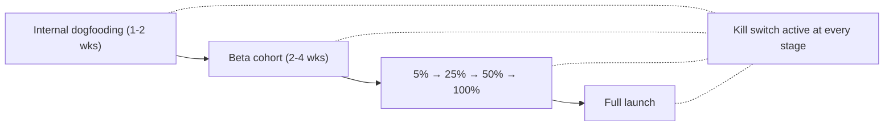

# Module 20: Production Readiness & Operations

## What "production-ready" means for AI

A traditional feature is production-ready when it works, has tests, and can be deployed safely. AI features need a higher bar. They can pass functional tests and still:

- Hallucinate confidently in ways that embarrass the company
- Degrade silently as the model, data, or domain changes
- Cost more in production than they generate in value
- Fail in novel ways no one anticipated

Production readiness for AI means having the right quality bar, the right rollout strategy, the right kill switch, and an explicit plan for the ongoing maintenance the feature will need *forever* — not just at launch.

This module covers what changes about going to production and staying there.

---

## The go/no-go quality bar

Before any AI feature ships, define a specific, measurable quality bar. Vague claims like "it works well" are a launch failure waiting to happen.

**A real quality bar has four properties:**

1. **Specific metric** — Acceptance rate, accuracy, task completion, etc.
2. **Numerical threshold** — Not "high acceptance" but "≥75% acceptance on the eval dataset"
3. **On a defined dataset** — Eval dataset (Module 17), not vibes
4. **Safety override** — No critical safety findings unresolved, regardless of quality score

```
Launch criteria for [feature name]:
- Acceptance rate ≥ 75% on representative eval set (n=50)
- Hallucination rate ≤ 3% on factual sample (n=100)
- P95 latency ≤ 4 seconds for interactive use
- Cost per request ≤ $0.025 at expected volume
- Zero unresolved critical findings from red-team
- Rollback plan documented and tested
```

**Failure to launch:** If any criterion isn't met, the feature doesn't ship — even if the date slips. The cost of launching a broken AI feature (reputation, trust, support load, incident response) far exceeds the cost of delay.

---

## Launch readiness levels

Not every AI feature needs the same quality bar before it ships. Match the threshold to the audience, the stakes, and the tolerance for error.

| Stage | Quality bar | What it means | Typical duration |
|-------|-------------|---------------|-----------------|
| Internal Alpha | 40% acceptance on eval set | Basic capability is demonstrated — the feature does the thing, but inconsistently. Appropriate only for internal users who understand they are testing early software. | 1–2 weeks |
| Controlled Beta | 60% acceptance | Core use cases are working. Known failure modes are documented and communicated to beta users. Edge cases still fail, but the main workflows are reliable enough for engaged early adopters. | 2–4 weeks |
| Early GA | 75% acceptance | Reliable on the main user flows. Edge cases are handled gracefully even if not perfectly. Monitoring is live and the team is watching quality signals actively. | Ongoing |
| Full GA | 85% acceptance | Production-ready. The feature handles the full range of expected inputs reliably. Monitoring, alerting, and incident response are fully operational. | Ongoing |
| Regulated / High-stakes | 95%+ acceptance | Required for features operating in medical, financial, legal, or other regulated contexts where errors carry legal or safety consequences. Requires audit trails and explainability in addition to high accuracy. | Ongoing |

These are reference thresholds, not universal rules. The right bar for your product depends on your error tolerance — a wrong answer in an internal analytics assistant carries different consequences than a wrong answer in a patient-facing medical tool. Adjust the thresholds up or down based on the cost of a failure in your specific context.

---

## Rollout strategy: power users → gradual → all

Don't ship AI features to 100% of users on day one. Stage the rollout to surface problems at small scale before they affect everyone.

### Stage 0: Shadow mode

Before exposing any users to the AI feature, run it in parallel with the existing system. The AI processes real production inputs and generates outputs, but those outputs are never shown to users — they are logged and compared to what the existing system produced.

Shadow mode is the safest possible way to measure quality on real-world inputs. It surfaces distribution shifts (your eval dataset didn't capture what users actually ask), latency issues at volume, and cost projections before any user is affected.

Shadow mode is particularly important when you are replacing existing deterministic functionality with AI. The existing system is your baseline. Shadow mode tells you whether the AI is ready to replace it, not just whether it passes your eval suite.

### Stage 1: Internal dogfooding (1–2 weeks)
The team building it uses it daily. Catches the obvious bugs and embarrassments.

### Stage 2: Power users / beta cohort (2–4 weeks)
Invite-only or feature-flagged for engaged users who can tolerate rough edges and provide quality feedback.

**Goals:**
- Validate quality at real-world scale (10–100× internal volume)
- Find failure modes that didn't appear in eval
- Refine UX based on real usage patterns

### Stage 3: Gradual percentage rollout (2–4 weeks)
Move from 5% → 25% → 50% → 100% of users with quality monitoring at each step.

**Move forward only if:**
- Acceptance rate holds at higher volume
- No new critical failure modes
- Cost remains within budget
- Support ticket volume is manageable

### Stage 4: Full rollout
Feature is generally available. Monitoring continues; eval dataset still runs on every prompt change.



---

## The kill switch: not optional

Every AI feature needs a kill switch — a fast way to disable it in production without a code deploy. This is not optional, and it must be tested before launch.

**What a kill switch does:**
- Disables the AI feature for all users immediately
- Falls back to a defined non-AI experience (or a graceful "unavailable" message)
- Stops any in-flight expensive operations (especially agent loops)

**Why you need one:**
- A jailbreak goes viral and produces harmful outputs at scale
- A model update silently breaks quality
- Cost runs away (compromised account, agent loop bug, prompt injection)
- A safety incident requires immediate containment

**How to implement:**
- Feature flag controlling the AI path vs. fallback
- Flag flippable by ops without engineering involvement
- Tested in production at least once before launch — preferably during the staged rollout
- Documented runbook: "Who flips this, in what scenarios, and what happens after"

**Test the kill switch.** Untested kill switches don't work in incidents — that's when you discover the flag isn't wired up correctly, or the fallback path has its own bugs.

---

## Context maintenance: the ongoing work nobody schedules

A common production failure: a feature that worked well at launch slowly degrades over months as the underlying domain changes but the AI's context doesn't.

**What gets stale:**

| Context source | How it goes stale | Detection signal |
|----------------|------------------|------------------|
| RAG index | Underlying docs updated, but index not re-built | Outdated facts in answers; users flag wrong info |
| System prompt | Refers to product features that changed | AI suggests workflows that no longer exist |
| Few-shot examples | Examples reflect old product/style/policy | Outputs feel "off" or out of date |
| Tool descriptions | Tool was renamed or its API changed | Tool calls fail or use wrong parameters |
| Model version | Provider updated the model under you | Quality drift on eval dataset |

**Maintenance schedule:**
- **Weekly:** Eval dataset run; sample output review
- **Monthly:** RAG index freshness audit; cost review
- **Quarterly:** Full prompt review; tool descriptions audit; eval dataset expansion; model version review

This work doesn't happen unless it's scheduled and owned. Assign a named owner for each AI feature's ongoing maintenance.

---

## Unit economics framework

Understanding whether an AI feature is economically viable requires more than knowing the cost per API call. The cost needs to be connected to business value through a chain of measures.

Use this fill-in framework:

```
Cost per request:         $___  (model tokens + infrastructure)
  x Requests per session: ___   (average turns to reach an outcome)
= Cost per session:       $___

Cost per session:         $___
  / Session success rate: ___%  (sessions that reach a successful outcome)
= Cost per outcome:       $___

Revenue per outcome:      $___  (or value proxy: time saved, support ticket deflected, etc.)
  - Cost per outcome:     $___
= Gross margin per outcome: $___
```

This chain forces the PM to connect infrastructure cost to business value at every step, and to identify exactly where the economics break down.

Common findings when teams run this framework:

- The cost per request looks fine, but the session success rate is low — meaning the cost per outcome is much higher than expected, and the feature is not economically viable at scale.
- The gross margin is positive but thin — meaning any model price increase or quality regression that lowers the success rate turns the feature unprofitable.
- The "revenue per outcome" is not defined — meaning the team is spending money on AI with no agreed-upon way to measure whether it's generating value.

Run this framework before launch to set economic expectations. Re-run it quarterly to track whether the economics are improving or deteriorating.

---

## Multi-domain scaling: when you have more than one AI feature

The first AI feature is straightforward. The second forces architectural decisions. By the third, you'll wish you'd made those decisions earlier.

### Scaling patterns

**Loose coupling (start here):** Each AI feature is fully independent — its own prompts, its own eval dataset, its own context and retrieval, its own tools. No shared logic, no shared conventions. Easy to ship the first 1–3 features this way; encourages experimentation and avoids premature standardisation.

**Shared conventions (next phase):** When you have 3+ features, the duplication starts hurting. Standardise the things that should be consistent without coupling the underlying logic:
- Prompt structure conventions
- Eval dataset format
- Logging and observability schema
- Prompt quality standards
- Model selection logic

Features remain independent — they share standards, not code.

**Orchestrated pipeline (when genuinely needed):** When features explicitly chain or coordinate — one feature's output becomes another's input, or a shared workflow spans multiple features — build explicit orchestration. This is where patterns from multi-agent architecture (Module 9) become relevant for whole-product flows.

The principle: start loose, tighten when you see real repetition. Premature standardisation slows you down; late standardisation creates cleanup work but you know what to standardise.

### Adding a new domain: 4-phase playbook

When expanding to a new domain, follow this sequence rather than integrating immediately.

**Phase 1: Treat it as isolated.** Build the new domain as if it were a standalone feature. Independent prompts, independent eval dataset, independent context architecture. Do not touch shared infrastructure. This isolates your build from existing features and keeps regression risk low.

**Phase 2: Adopt shared conventions.** Once the new domain is working in isolation, align it to your existing standards: adopt the shared eval format, the observability schema, the prompt structure conventions, and the model selection logic. This is convention adoption, not code sharing — the domain remains independent.

**Phase 3: Identify integration points with existing features.** Now look explicitly for interactions: Does this domain's output feed another feature? Do users ask cross-domain questions that span this domain and an existing one? Does this domain need access to shared user context? Identify these points before integrating.

**Phase 4: Define shared services if warranted.** If multiple domains genuinely need the same service — shared memory, a shared tool registry, shared user preference context — define and build those shared services deliberately. Do not share these services before you have confirmed multiple domains need them; premature sharing creates coupling you'll later regret.

### Signals that your multi-domain architecture is breaking down

| Warning signal | What it means |
|---|---|
| Eval regressions in feature A when feature B changes | The domains are not isolated — shared logic or context is coupling them in ways that create unexpected cross-domain effects |
| Shared prompts growing too large to maintain | Shared context that was meant to serve all features is trying to serve too many masters; domain-specific context has leaked into shared layers |
| Routing logic becoming the most complex part of the system | The router is accumulating domain-specific rules and exceptions, which is a sign the domains have not been cleanly separated and the router is doing work that belongs inside the domains themselves |

If you see these signals, the architecture has drifted. The fix is to re-isolate — push shared logic back into the domains that own it, not to make the shared layer more sophisticated.

---

## The ongoing PM cadence for AI features

AI features need ongoing PM attention in a way traditional features don't. Set this rhythm explicitly.

### Weekly (15–30 min)
- Acceptance / regeneration / thumbs down trends
- Top 3 reported failure cases from support
- Any production incidents
- Eval dataset additions from the week's failures

### Monthly (1–2 hours)
- Full quality metrics review vs. launch baseline
- Cost vs. budget; cost per outcome trend
- RAG index freshness check
- New failure modes audit

### Quarterly (half-day)
- Prompt and tool description audit
- Eval dataset expansion plan
- Model version evaluation (test newer models against your eval set)
- Feature retrospective: what's improved, what hasn't, what's next
- Maintenance backlog review

**Skip these and the feature degrades.** This is the core insight: AI features don't run themselves. They need ongoing attention, and that attention has to be scheduled.

---

## AI incident playbook

AI incidents are different from traditional software incidents: the system is often "up" while producing wrong, misleading, or harmful output. The standard incident response playbook needs adaptation.

Follow these 7 steps for any AI quality or safety incident.

**Step 1: Detect.** Define in advance what triggers an incident declaration. This is not something you want to decide during an incident. Define specific thresholds: error rate crossing X%, safety filter spike of Y times baseline, user report volume exceeding Z per hour, a single confirmed harmful output. Write these down and share them with the team before launch.

**Step 2: Contain.** Use the kill switch or traffic reduction to stop the bleeding. For partial failures, reduce rollout percentage. For severe failures (harmful output, safety incident), disable the feature entirely. Contain first; diagnose second. Do not spend time diagnosing while the failure is still reaching users.

**Step 3: Assess severity.** Classify the incident before deciding on urgency. Is this cosmetic (output quality has declined but no user harm), functional (the feature is not accomplishing its core task), trust-eroding (users are receiving incorrect information they may act on), or harmful (output could cause real-world harm to a user or third party)? The classification determines escalation path and response speed.

**Step 4: Communicate.** Follow the internal escalation path appropriate to the severity level. For trust-eroding or harmful incidents, prepare a user-facing message — even a brief "we're aware of an issue and are investigating" is better than silence. Have message templates prepared before an incident, not during one.

**Step 5: Remediate.** Based on the root cause diagnosis (from Module 18's framework), implement the fix: prompt rollback (revert to a previous known-good system prompt), model version rollback (if the failure was caused by a model update), or a targeted hotfix (add a guardrail, update the retrieval index, fix a tool). Do not ship a fix without running the eval suite first.

**Step 6: Postmortem.** After the incident is resolved, document what failed, which layer it was in, and — critically — what eval check should have caught it but didn't. A good AI postmortem produces a specific gap in the eval suite, not just a description of what went wrong.

**Step 7: Update the eval dataset.** Add the failure case that caused the incident to the eval suite. This is the step that prevents recurrence. An incident that adds a new eval case has made the system permanently more robust. An incident that doesn't is likely to recur.

---

## How AI product lifecycles differ from traditional software

| Dimension | Traditional software | AI features |
|-----------|---------------------|------------|
| **Behaviour at launch** | Defined by code | Defined by code + prompt + model + data |
| **Drift after launch** | Static unless code changes | Can drift from model updates, data drift, or prompt edits |
| **"Done"** | Ship, fix bugs, occasional features | Never done — continuous quality work |
| **Quality testing** | Unit/integration tests run on PR | Eval datasets run on every prompt/model change |
| **Cost model** | Mostly fixed (servers) | Variable per request — needs ongoing optimisation |
| **Failure modes** | Mostly known and detectable | Novel failures emerge in production |
| **Rollback** | Revert deploy | Revert deploy + revert prompt + revert RAG index version |

The most important difference: **AI features have a continuous attention model**. Budgeting team time for ongoing AI maintenance is a structural decision. Teams that don't do this end up with a graveyard of degraded AI features that worked at launch and don't anymore.

---

## Handover and team scaling

When the PM or engineer who built the feature moves on, the feature has to keep working. Handover-ready means:

- [ ] System prompt is in version control with comments explaining design decisions
- [ ] Eval dataset is documented (what each case tests and why)
- [ ] Common failure modes are documented with their fixes
- [ ] Cost and quality baselines are recorded
- [ ] Maintenance runbook exists (weekly/monthly/quarterly tasks)
- [ ] Incident playbook is documented and the kill switch is testable
- [ ] At least one other person can answer "why is this prompt structured this way?"

If a feature can't be handed over, it's going to degrade as soon as the original owner leaves.

---

## PM Decision Checklist — Module 20

**Pre-launch:**
- [ ] Is the launch quality bar defined as specific metrics with numerical thresholds?
- [ ] Is the appropriate launch readiness level selected for this feature's audience and risk profile?
- [ ] Is there a staged rollout plan (shadow mode → internal → beta → gradual → full)?
- [ ] Is the kill switch implemented, documented, and tested in production?
- [ ] Is the rollback plan documented (prompt, model version, RAG index)?
- [ ] Has the unit economics framework been run to confirm the feature is economically viable at expected volume?

**Operations:**
- [ ] Is a named owner assigned for ongoing maintenance?
- [ ] Is the weekly/monthly/quarterly cadence scheduled in calendars?
- [ ] Does the team have a runbook for common incidents?
- [ ] Is the kill switch flippable by ops without engineering involvement?
- [ ] Are incident severity classifications and escalation paths defined before launch?

**Scaling (when shipping multiple AI features):**
- [ ] Have I identified what should be shared (conventions, observability, tools) vs. feature-specific?
- [ ] Are we starting loose and tightening when we see real repetition — not pre-optimising?
- [ ] Are there any of the three architectural breakdown signals present (cross-feature regressions, oversized shared prompts, complex routing logic)?

**Handover:**
- [ ] Are prompt design decisions documented in the prompt file itself?
- [ ] Could a new PM pick up this feature and run the maintenance cadence from documentation alone?
